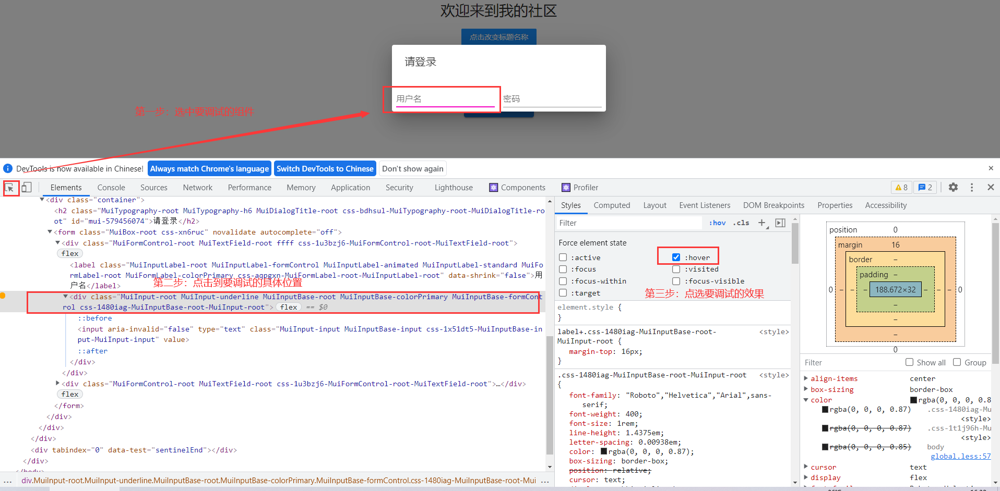

# Css

## 防止element.style覆盖自定义样式

参考：https://blog.csdn.net/hi_dzj/article/details/7092032

```css
/* 在被覆盖的样式后添加`!important`即可：*/
#logo{
border: solid 1px blue !important;
}
```

## 浏览器如何调试css的hover、focus等样式



# Vue

# LayUI

## 数据表格跨域session配置

修改table.js底层源码，进入table.js搜索 .ajax，增加跨域参数：

```javascript
t.ajax({
                type: a.method || "get",
                url: a.url,
                /*设置跨域支持session -----------------------------*/
                xhrFields: {withCredentials: true},
                crossDomain: true,
                /*设置跨域支持session -----------------------------*/
                contentType: a.contentType,
                data: d,
                dataType: "json",
                headers: a.headers || {},
                success: function (t) {
                    ......
                },
                error: function (e, t) {
                    i.errorView("数据接口请求异常：" + t), i.renderForm(), i.setColsWidth()
                }
```

## 父子页面参数互传配置

1、父页面传值给子页面：

```js
/* 父页面 */
var parent_data;
parent_data = JSON.stringify(data);//注意：这里的parent_data只能是全局变量，这样才能在子页面拿到parent_data

/* 子页面 */
let son_data = eval('('+parent.parent_data+')');//eval是将该string类型的json串变为javaScript对象
```

2、子页面传值给父页面：

参考：https://www.jb51.net/article/169697.htm

## 动态渲染Select下拉框

参考：[参考链接](https://blog.csdn.net/zengqifeng1997/article/details/84996017?utm_medium=distribute.pc_relevant.none-task-blog-BlogCommendFromMachineLearnPai2-4.baidujs&dist_request_id=1328741.1758.16167652826575843&depth_1-utm_source=distribute.pc_relevant.none-task-blog-BlogCommendFromMachineLearnPai2-4.baidujs)

```html
 <select id="selectId" name="interest" lay-filter="city">
```

```js
layui.use(['form','jquery'], function(){
	
  //----------模块----------
  var form = layui.form;
  
  //动态添加下拉框     同时可以设置默认值
  $.ajax({
    ...
    success:function(data){
    
        //遍历后台返回的数据
        $.each(data,function(index,item){
        	console.log(item);
        	//option  第一个参数是页面显示的值，第二个参数是传递到后台的值
        	$('#selectId').append(new Option(item.name,item.id));//往下拉菜单里添加元素
        	//设置value（这个值就可以是在更新的时候后台传递到前台的值）为selected_id的值为默认选中
        	$('#selectId').val(selected_id);//设置默认选中项,自己指定一个id即可，渲染时会比对每一项的value，相同则会设置为选中
        })
 
        form.render(); //更新全部表单内容
					//form.render('select'); //刷新表单select选择框渲染
    }
   });
});
```

## 子页面关闭父页面刷新

参考：[参考链接](https://blog.csdn.net/COCOLI_BK/article/details/87904116?utm_medium=distribute.pc_relevant.none-task-blog-BlogCommendFromMachineLearnPai2-1.baidujs&dist_request_id=&depth_1-utm_source=distribute.pc_relevant.none-task-blog-BlogCommendFromMachineLearnPai2-1.baidujs)

```js
success: function (res) {
              if (res.status == 200) {
                  /* 先得到当前iframe层的索引 */
                  var index = parent.layer.getFrameIndex(window.name); 
                  /* 主页代码，第一个参数为： 父页面的表格属性 id名 */
                  parent.layui.table.reload('educationReload',{page:{curr:1}}); 
                  parent.layer.close(index); //成功再执行关闭
                  parent.layer.msg("编辑成功");
              } else {
                  parent.layer.msg(res.msg);
              }
          }
```

## layui.msg指定时间后跳转

在使用layui.msg()是,通常我们会有一个提示消息,停留几秒之后跳转,用layui.msg的第二个参数time就可以很简单的实现

```js
layer.msg(d.msg,{time:3000},function() {
      location.href = "...";
 });
                        
```

一般结合子页面关闭返回父页面使用

```js
layer.msg(result.message, {time: 3000},function () {
                    let index = parent.layer.getFrameIndex(window.name); 
                    parent.layui.table.reload('currentTableId',{page:{curr:1}}); 
                    parent.layer.close(index); 
                })
```

# JQuery

## 文档就绪事件

为了防止文档在完全加载（就绪）之前运行 jQuery 代码，即在 DOM 加载完成后才可以对 DOM 进行操作。如果在文档没有完全加载之前就运行函数，操作可能失败。

写法如下：

```js
$(document).ready(function(){
   // 开始写 jQuery 代码...
});

简洁写法
$(function(){
   // 开始写 jQuery 代码...
});
```

innerHTML的使用

innerHTML可获取或设置指定元素标签内的 html内容bai，从该元素标签的起始位置到终止位置的全部内容(包含html标签)。

- 获取元素的内容：element.innerHTML;

- 给元素设置内容：element.innerHTML =htmlString;

1、javaScript获取：

```js
<span id="content">‘我是span标签的内容’</span>

var cont=document.getElementById("content");
console.log('innerText cont= '+ cont.innerText); 
console.log('innerHtml cont= '+ cont.innerHTML); 
//以上两条都能输出span标签的值‘我是span标签的内容’；
```

2、jquery获取：

```js
<span id="content">‘我是span标签的内容’</span>

var cont=$("#content");
console.log(cont.val()); //输出  (无值);
console.log(cont.text()); //输出 ‘我是span标签的内容’;
console.log(cont.html()); //输出 ‘我是span标签的内容’;
```

3、javaScript设置：

```js
document.getElementById('test').innerHTML = "innerHTML内容"
```

4、jquery设置：

```js
$('#test').html("innerHTML内容")
```

## 获取和设置input的value

1、获取值：

```js
$(selector).val()
```

2、设置值：

```js
$(selector).val(value)
```

## 锚点跳转

1、html页面锚点：

```html
<a name="firstAnchor">&nsbp;</a>

<a href="#firstAnchor">跳至第一个锚点</a>
```

2、js跳转锚点：

```js
location.href = "#firstAnchor";      // firstAnchor为锚点名称

window.location.hash = "#firstAnchor"; // firstAnchor为锚点名称
```

hash只会在跳转到此页面的第一次起作用，再次刷新此页面将不起作用，而href始终起作用

## 添加和删除元素

- $.each()方法 - 遍历数组；
- append() - 在被选元素的结尾（标签内部）插入内容（含html标签）；
- empty() - 从被选元素中删除其子元素；

## Cookie回显数据至不同页面

通过设置Cookie，然后在另一个页面取出Cookie，访问接口，取出要回显的数据，显示在页面上即可；

1、下载Cookie插件：

地址：https://github.com/js-cookie/js-cookie

2、使用：

```js
//导包
<script src="/path/to/jquery.cookie.js"></script>

//用法

//创建
$.cookie('name', 'value');

//获取
$.cookie('name'); // => "value"
$.cookie(); // => { "name": "value" } 获取所有Cookie

//删除
$.removeCookie('name'); // => true
```

# 三方插件

## sPage分页

### 地址

插件地址：https://github.com/jvbei/sPage

### 使用示例

如何使用：参考该仓库下的ReadMe文档；

```js
<script type="text/javascript">
			$(function(){
				// 示例1
				$("#myPage").sPage({
					page:1,//当前页码，必填
					total:888,//数据总条数，必填
					pageSize:10,//每页显示多少条数据，默认10条
					showTotal:true,//是否显示总条数，默认关闭：false
					totalTxt:"共{total}条",//数据总条数文字描述，{total}为占位符，默认"共{total}条"
					noData: false,//没有数据时是否显示分页，默认false不显示，true显示第一页
					showSkip:true,//是否显示跳页，默认关闭：false
					showPN:true,//是否显示上下翻页，默认开启：true
					prevPage:"上一页",//上翻页文字描述，默认“上一页”
					nextPage:"下一页",//下翻页文字描述，默认“下一页”
					fastForward: 5,//快进快退页数，默认0表示不开启快进快退
					backFun:function(page){
						//点击分页按钮回调函数，返回当前页码
						$("#pNum").text(page);
					}
				});
				// 后台数据请求示例, 首次进入页面默认请求第一页;
				ajaxPage(1);
			});
			//结合Ajax使用，仅供参考
			function ajaxPage(page){
				var p = page || 1;
				$.ajax({
					type: "POST",
					url: "/article/find-all-with-sPage",
					data: {
						page:p,
						pageSize:5
					},
					dataType: "json",
					success: function(result){
						//数据处理
						//console.log("List<Article>" + result.data)

						//遍历List<Article>，并渲染到页面上
						let articleList = result.data;
						$.each(articleList, function (key, value) {//这里的每个value都是一个article
                            console.log("--Key：" + key + " --主键：" + value.aid + " --标题：" + value.title);

                            //渲染数据至表格
                            $('#tbody').append(
                                '<tr>\n' +
                                '<th scope="row">'+ value.aid +'</th>\n' +
                                '<td>'+ value.title +'</td>\n' +
                                '<td>'+ value.publishTime +'</td>\n' +
                                '<td>'+ value.description +'</td>\n' +
                                '<td>\n' +
                                '<button type="button" class="btn btn-primary">更新</button>\n' +
                                '<button type="button" class="btn btn-danger">丢弃</button>\n' +
                                '</td>\n' +
                                '</tr>'
                            )
                        });


						// 调用分页插件
						$("#myPage").sPage({
							page:p,//当前页码
							pageSize:5,//每页显示多少条数据，默认10条
							total:result.totalSize,//数据总条数,后台返回
                            pageSize:result.pageSize,//每页显示多少条数据，默认10条
                            showTotal:true,//是否显示总条数，默认关闭：false
                            totalTxt:"共{total}条",//数据总条数文字描述，{total}为占位符，默认"共{total}条"
                            noData: false,//没有数据时是否显示分页，默认false不显示，true显示第一页
                            showSkip:true,//是否显示跳页，默认关闭：false
                            showPN:true,//是否显示上下翻页，默认开启：true
                            prevPage:"上一页",//上翻页文字描述，默认“上一页”
                            nextPage:"下一页",//下翻页文字描述，默认“下一页”
                            fastForward: 5,//快进快退页数，默认0表示不开启快进快退
                            //点击分页按钮回调函数，page参数是用户点击的页码数，点击分页即执行ajaxPage(page);方法
							backFun:function(page){
                                $("#tbody").empty();
								ajaxPage(page);
							}
						});
					},
					error:function(e){
						console.log(e);
					}
				});
			}
		</script>
```

## SweetAlert弹窗

### 地址

官网网址：[sweetalert](https://www.sweetalert.cn/guides.html#installation)    [sweetalert2.0](https://sweetalert2.github.io/#examples)

### 依赖

```js
<script src="sweetalert2/dist/sweetalert.min.js"></script>
<link rel="stylesheet" href="sweetalert2/dist/sweetalert.min.css">
```

### 使用示例

```java
$.ajax({
			type: "POST",
			url: "/login",
			data: JSON.stringify($('#loginForm').serializeJSON()),
			dataType: "json",
			contentType:"application/json",
			success: function (result) {

				if (result.account === 'pangchun'){

					swal({
								title: "验证成功 !!",
								text: "欢迎您 " + result.account + " !!",
								type: "success",
								button: true
							},
							function(value){//这个value就是button的值
								if (value) {
									window.location.href="/admin/adfa";
								}
							});

				} else {

					//sweetAlert()与swal()作用相同
					sweetAlert("验证失败", "非法用户 " + result.account + " !!", "error");
				}
			}

		});
```


