# CMD

## cmd编码格式修改

- 修改cmd默认编码格式： https://jingyan.baidu.com/article/f7ff0bfcee2dc22e26bb13d5.html
- 永久修改cmd编码格式： https://blog.csdn.net/qq_35038153/article/details/78430359

## cmd以管理员权限打开

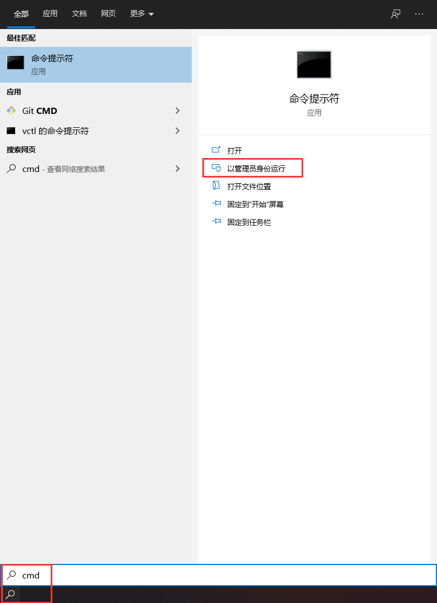

# Git

## 修改用户名以及邮箱

1. 进入git bash，输入git config --list，最后几行有user.name和user.email。
2. 设置用户名：git config --global user.name "你的用户名"。
3. 设置邮箱：git config --global user.email "你的邮箱"。
4. 如果报错，使用git config --global --replace-all user.name "你的用户名"，git config --global --replace-all user.email "你的邮箱" 。

## 回滚历史版本

1. 执行git reflog命令查看你的历史变更记录；
2. git reset --hard 2aee3f(拉代码之前的提交记录)；

## 指定不上传的文件夹

在使用 vue-cli 脚手架的时候，有一个依赖模板文件夹是不希望被上传到git上的，因为里面文件太多了。

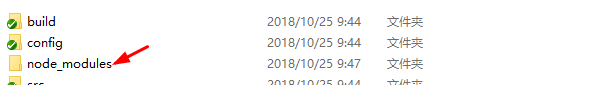

解决办法：手动创建git忽略push清单，node_module以及自身

1.文件夹内右键git bash，输 touch .gitignore，注意中间有空格。 

2.编辑器打开生成的 .gitignore 文件，加入:

```
node_modules

/*以及其他你想要忽略的文件或文件夹*/
```

3.保存。

4.以后再add到暂存区的时候就会忽略你配置的文件或文件夹了。

一般来说：git是的默认项目里也是有配置的：

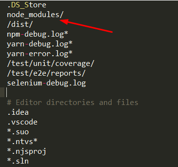

 忽略具体的文件或文件夹：

```
/target/  // 忽略这个target 目录
log/*     // 忽略log下的所有文件
css/*.css // 忽略css目录下的.css文件
```

# IDEA

## 自定义模板快捷键

1、新增分组myGroup：

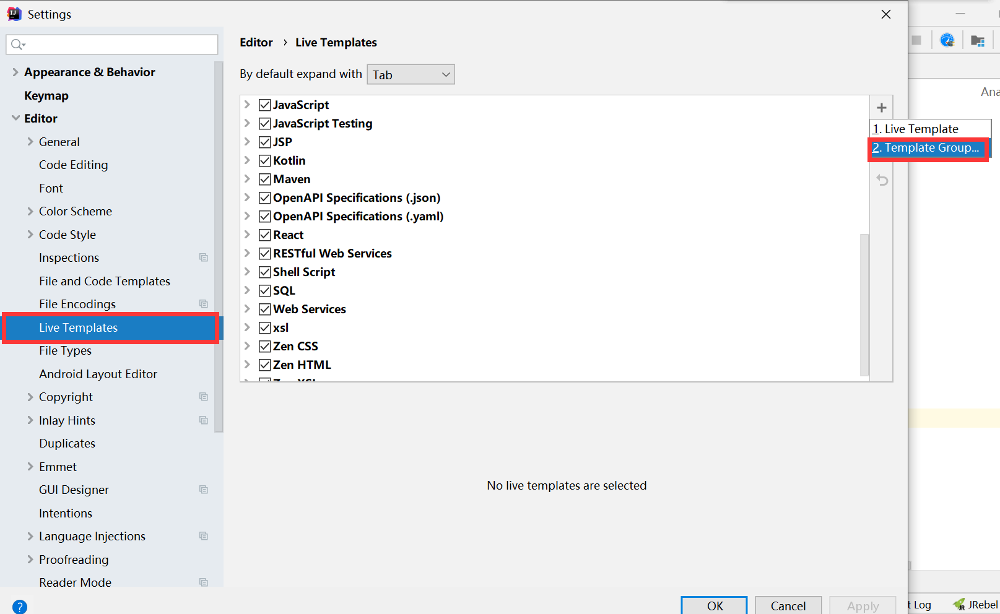

2、新增模板gt：

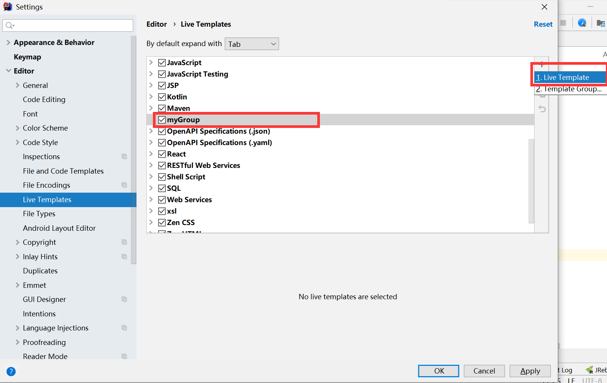

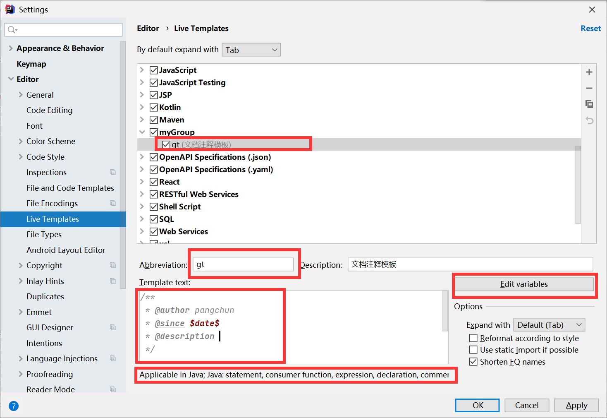

3、输入gt生成模板：

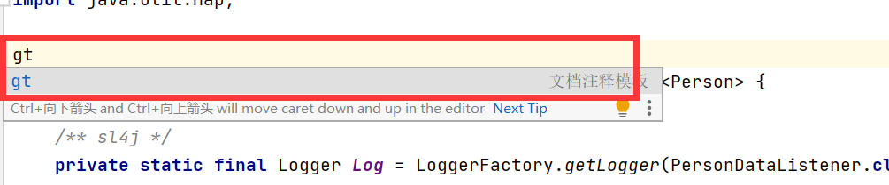

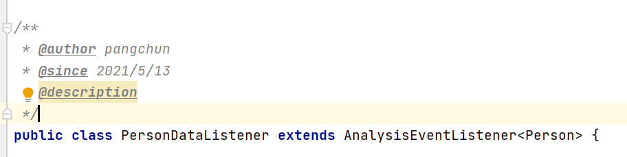

## JRebel热部署插件配置

### 配置插件

配置插件：https://www.cnblogs.com/xzh0717/p/11717854.html#/c/subject/p/11717854.html

### 常见问题

==1、电脑账户中文名导致报错：==

错误描述：JRebel-JVMTI [FATAL] Couldn‘t write to C:\Users\中文账户名；

原因：C:\Users\后面的路径中有中文；

解决如下：

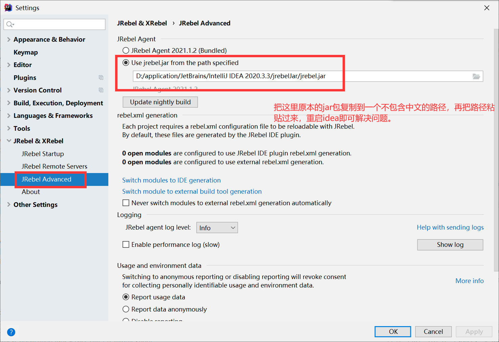

## MyBatisCodeHelperPro代码生成器

### 地址

- 插件下载地址：https://plugins.jetbrains.com/plugin/14522-mybatiscodehelperpro-marketplace-edition-/versions
- github地址：https://github.com/gejun123456/MyBatisCodeHelper-Pro
- 使用文档地址：http://118.24.53.162/#/
- 使用介绍博客参考地址：https://www.jb51.net/article/196641.htm

### 激活码

这个激活码只有idea使用jetbrains-agent方式激活的才能生效：

```
06KU174Y5C-eyJsaWNlbnNlSWQiOiIwNktVMTc0WTVDIiwibGljZW5zZWVOYW1lIjoia216amhwdCBwYmV2IiwiYXNzaWduZWVOYW1lIjoiIiwiYXNzaWduZWVFbWFpbCI6IiIsImxpY2Vuc2VSZXN0cmljdGlvbiI6IiIsImNoZWNrQ29uY3VycmVudFVzZSI6ZmFsc2UsInByb2R1Y3RzIjpbeyJjb2RlIjoiUE1ZQkFUSVNMT0ciLCJmYWxsYmFja0RhdGUiOiIyMDIzLTA3LTA3IiwicGFpZFVwVG8iOiIyMDIzLTA3LTA3In0seyJjb2RlIjoiUEhZQlJJU0NPTU1FUkNFIiwiZmFsbGJhY2tEYXRlIjoiMjAyMy0wNy0wNyIsInBhaWRVcFRvIjoiMjAyMy0wNy0wNyJ9LHsiY29kZSI6IlBSTkNPTlNPTEUiLCJmYWxsYmFja0RhdGUiOiIyMDIzLTA3LTA3IiwicGFpZFVwVG8iOiIyMDIzLTA3LTA3In0seyJjb2RlIjoiUFJFRElTIiwiZmFsbGJhY2tEYXRlIjoiMjAyMy0wNy0wNyIsInBhaWRVcFRvIjoiMjAyMy0wNy0wNyJ9LHsiY29kZSI6IlBWTE9HIiwiZmFsbGJhY2tEYXRlIjoiMjAyMy0wNy0wNyIsInBhaWRVcFRvIjoiMjAyMy0wNy0wNyJ9LHsiY29kZSI6IlBBRU0iLCJmYWxsYmFja0RhdGUiOiIyMDIzLTA3LTA3IiwicGFpZFVwVG8iOiIyMDIzLTA3LTA3In0seyJjb2RlIjoiUFJVQllDT0RFU1VHRyIsImZhbGxiYWNrRGF0ZSI6IjIwMjMtMDctMDciLCJwYWlkVXBUbyI6IjIwMjMtMDctMDcifSx7ImNvZGUiOiJQTUVTT05TWU5UQVgiLCJmYWxsYmFja0RhdGUiOiIyMDIzLTA3LTA3IiwicGFpZFVwVG8iOiIyMDIzLTA3LTA3In0seyJjb2RlIjoiUFZDUyIsImZhbGxiYWNrRGF0ZSI6IjIwMjMtMDctMDciLCJwYWlkVXBUbyI6IjIwMjMtMDctMDcifSx7ImNvZGUiOiJQQ09ERUFJSUNFQkVSRyIsImZhbGxiYWNrRGF0ZSI6IjIwMjMtMDctMDciLCJwYWlkVXBUbyI6IjIwMjMtMDctMDcifSx7ImNvZGUiOiJQU1dQTFVHSU4iLCJmYWxsYmFja0RhdGUiOiIyMDIzLTA3LTA3IiwicGFpZFVwVG8iOiIyMDIzLTA3LTA3In0seyJjb2RlIjoiUFNDSVBJTyIsImZhbGxiYWNrRGF0ZSI6IjIwMjMtMDctMDciLCJwYWlkVXBUbyI6IjIwMjMtMDctMDcifSx7ImNvZGUiOiJQSUVESVMiLCJmYWxsYmFja0RhdGUiOiIyMDIzLTA3LTA3IiwicGFpZFVwVG8iOiIyMDIzLTA3LTA3In0seyJjb2RlIjoiUEpGT1JNREVTSUdORVIiLCJmYWxsYmFja0RhdGUiOiIyMDIzLTA3LTA3IiwicGFpZFVwVG8iOiIyMDIzLTA3LTA3In0seyJjb2RlIjoiUFdMQU5HIiwiZmFsbGJhY2tEYXRlIjoiMjAyMy0wNy0wNyIsInBhaWRVcFRvIjoiMjAyMy0wNy0wNyJ9LHsiY29kZSI6IlBKQVZBQ09ERVNVR0ciLCJmYWxsYmFja0RhdGUiOiIyMDIzLTA3LTA3IiwicGFpZFVwVG8iOiIyMDIzLTA3LTA3In0seyJjb2RlIjoiUENNQUtFUExVUyIsImZhbGxiYWNrRGF0ZSI6IjIwMjMtMDctMDciLCJwYWlkVXBUbyI6IjIwMjMtMDctMDcifSx7ImNvZGUiOiJQSkVURk9SQ0VSIiwiZmFsbGJhY2tEYXRlIjoiMjAyMy0wNy0wNyIsInBhaWRVcFRvIjoiMjAyMy0wNy0wNyJ9LHsiY29kZSI6IlBQSFBDT0RFU1VHRyIsImZhbGxiYWNrRGF0ZSI6IjIwMjMtMDctMDciLCJwYWlkVXBUbyI6IjIwMjMtMDctMDcifSx7ImNvZGUiOiJQR09MQU5HQ09ERVNVR0ciLCJmYWxsYmFja0RhdGUiOiIyMDIzLTA3LTA3IiwicGFpZFVwVG8iOiIyMDIzLTA3LTA3In0seyJjb2RlIjoiUFpFTlVNTCIsImZhbGxiYWNrRGF0ZSI6IjIwMjMtMDctMDciLCJwYWlkVXBUbyI6IjIwMjMtMDctMDcifSx7ImNvZGUiOiJQTVJJTlRFR0VFIiwiZmFsbGJhY2tEYXRlIjoiMjAyMy0wNy0wNyIsInBhaWRVcFRvIjoiMjAyMy0wNy0wNyJ9LHsiY29kZSI6IlBPUEVOQVBJIiwiZmFsbGJhY2tEYXRlIjoiMjAyMy0wNy0wNyIsInBhaWRVcFRvIjoiMjAyMy0wNy0wNyJ9LHsiY29kZSI6IlBCQVNIU1VQUE9SVFBSTyIsImZhbGxiYWNrRGF0ZSI6IjIwMjMtMDctMDciLCJwYWlkVXBUbyI6IjIwMjMtMDctMDcifSx7ImNvZGUiOiJQREIiLCJmYWxsYmFja0RhdGUiOiIyMDIzLTA3LTA3IiwicGFpZFVwVG8iOiIyMDIzLTA3LTA3In0seyJjb2RlIjoiUEpEQ0xFQU5SRUFEIiwiZmFsbGJhY2tEYXRlIjoiMjAyMy0wNy0wNyIsInBhaWRVcFRvIjoiMjAyMy0wNy0wNyJ9LHsiY29kZSI6IlBCUldKViIsImZhbGxiYWNrRGF0ZSI6IjIwMjMtMDctMDciLCJwYWlkVXBUbyI6IjIwMjMtMDctMDcifSx7ImNvZGUiOiJQTUFOSUZPTEQiLCJmYWxsYmFja0RhdGUiOiIyMDIzLTA3LTA3IiwicGFpZFVwVG8iOiIyMDIzLTA3LTA3In0seyJjb2RlIjoiUENSRVZJRVciLCJmYWxsYmFja0RhdGUiOiIyMDIzLTA3LTA3IiwicGFpZFVwVG8iOiIyMDIzLTA3LTA3In0seyJjb2RlIjoiUFNGQ0MiLCJmYWxsYmFja0RhdGUiOiIyMDIzLTA3LTA3IiwicGFpZFVwVG8iOiIyMDIzLTA3LTA3In0seyJjb2RlIjoiUExBUkFWRUwiLCJmYWxsYmFja0RhdGUiOiIyMDIzLTA3LTA3IiwicGFpZFVwVG8iOiIyMDIzLTA3LTA3In0seyJjb2RlIjoiUEJJU0oiLCJmYWxsYmFja0RhdGUiOiIyMDIzLTA3LTA3IiwicGFpZFVwVG8iOiIyMDIzLTA3LTA3In0seyJjb2RlIjoiUE1ETkFWIiwiZmFsbGJhY2tEYXRlIjoiMjAyMy0wNy0wNyIsInBhaWRVcFRvIjoiMjAyMy0wNy0wNyJ9LHsiY29kZSI6IlBRTUxFRElUT1IiLCJmYWxsYmFja0RhdGUiOiIyMDIzLTA3LTA3IiwicGFpZFVwVG8iOiIyMDIzLTA3LTA3In0seyJjb2RlIjoiUEZMVVRURVIiLCJmYWxsYmFja0RhdGUiOiIyMDIzLTA3LTA3IiwicGFpZFVwVG8iOiIyMDIzLTA3LTA3In0seyJjb2RlIjoiUENZUFJFU1NQUk8iLCJmYWxsYmFja0RhdGUiOiIyMDIzLTA3LTA3IiwicGFpZFVwVG8iOiIyMDIzLTA3LTA3In0seyJjb2RlIjoiUFBZQ09ERVNVR0ciLCJmYWxsYmFja0RhdGUiOiIyMDIzLTA3LTA3IiwicGFpZFVwVG8iOiIyMDIzLTA3LTA3In0seyJjb2RlIjoiUFRPT0xTRVQiLCJmYWxsYmFja0RhdGUiOiIyMDIzLTA3LTA3IiwicGFpZFVwVG8iOiIyMDIzLTA3LTA3In0seyJjb2RlIjoiUE1JTkJBVElTIiwiZmFsbGJhY2tEYXRlIjoiMjAyMy0wNy0wNyIsInBhaWRVcFRvIjoiMjAyMy0wNy0wNyJ9LHsiY29kZSI6IlBDT0RFTVIiLCJmYWxsYmFja0RhdGUiOiIyMDIzLTA3LTA3IiwicGFpZFVwVG8iOiIyMDIzLTA3LTA3In0seyJjb2RlIjoiUE1ZQkFUSVNIRUxQRVIiLCJmYWxsYmFja0RhdGUiOiIyMDIzLTA3LTA3IiwicGFpZFVwVG8iOiIyMDIzLTA3LTA3In0seyJjb2RlIjoiUEpTQ09ERVNVR0ciLCJmYWxsYmFja0RhdGUiOiIyMDIzLTA3LTA3IiwicGFpZFVwVG8iOiIyMDIzLTA3LTA3In0seyJjb2RlIjoiUE9GRklDRUZMT09SIiwiZmFsbGJhY2tEYXRlIjoiMjAyMy0wNy0wNyIsInBhaWRVcFRvIjoiMjAyMy0wNy0wNyJ9LHsiY29kZSI6IlBSREZBTkRTUEFSUUwiLCJmYWxsYmFja0RhdGUiOiIyMDIzLTA3LTA3IiwicGFpZFVwVG8iOiIyMDIzLTA3LTA3In0seyJjb2RlIjoiUEdET0MiLCJmYWxsYmFja0RhdGUiOiIyMDIzLTA3LTA3IiwicGFpZFVwVG8iOiIyMDIzLTA3LTA3In0seyJjb2RlIjoiUFNNQVJUSlVNUCIsImZhbGxiYWNrRGF0ZSI6IjIwMjMtMDctMDciLCJwYWlkVXBUbyI6IjIwMjMtMDctMDcifSx7ImNvZGUiOiJQQVdTTEFNQkRBREVQTFIiLCJmYWxsYmFja0RhdGUiOiIyMDIzLTA3LTA3IiwicGFpZFVwVG8iOiIyMDIzLTA3LTA3In0seyJjb2RlIjoiUE9SQ0hJREUiLCJmYWxsYmFja0RhdGUiOiIyMDIzLTA3LTA3IiwicGFpZFVwVG8iOiIyMDIzLTA3LTA3In0seyJjb2RlIjoiUFBPSk9UT0pTT05TQ0giLCJmYWxsYmFja0RhdGUiOiIyMDIzLTA3LTA3IiwicGFpZFVwVG8iOiIyMDIzLTA3LTA3In0seyJjb2RlIjoiUFJPTiIsImZhbGxiYWNrRGF0ZSI6IjIwMjMtMDctMDciLCJwYWlkVXBUbyI6IjIwMjMtMDctMDcifSx7ImNvZGUiOiJQU1ZFUklMT0ciLCJmYWxsYmFja0RhdGUiOiIyMDIzLTA3LTA3IiwicGFpZFVwVG8iOiIyMDIzLTA3LTA3In0seyJjb2RlIjoiUFNQRUxMQk9PSyIsImZhbGxiYWNrRGF0ZSI6IjIwMjMtMDctMDciLCJwYWlkVXBUbyI6IjIwMjMtMDctMDcifV0sImhhc2giOiIxMjc5Njg3Ny8wIiwiZ3JhY2VQZXJpb2REYXlzIjo3LCJhdXRvUHJvbG9uZ2F0ZWQiOmZhbHNlLCJpc0F1dG9Qcm9sb25nYXRlZCI6ZmFsc2V9-k3wWAJ+rfNRY8dj6Ard1OJ/aNuArIop6bDi3ydv+do2b26k+N4bq0lmckhlq+EWK8MHkyFee4L7PWTd8bbsdpxqh0aLEAIO6vWpx7NvbstuVcr26YR4028IIgypr75tts+wu2oPfyriYvBaDP1R7T/nR6hJBfKzoCJprYWr/SX9wPxWLmC/ghC2iS80OrZfvJ2NnbU31T8GswYVoU/R2iloRJ5tlXz9mrvUMry43FqzHnh7SUcnwMHtVaNnm+d5LQGxNyrhEpmW14U5Ya48r8IjceBUzRq3VGsrmfXpXSfw8pkc9NqMvdX8olRjM51rZHpDyN9UlnOfZRTJyao2IXA==-MIIElTCCAn2gAwIBAgIBCTANBgkqhkiG9w0BAQsFADAYMRYwFAYDVQQDDA1KZXRQcm9maWxlIENBMB4XDTE4MTEwMTEyMjk0NloXDTIwMTEwMjEyMjk0NlowaDELMAkGA1UEBhMCQ1oxDjAMBgNVBAgMBU51c2xlMQ8wDQYDVQQHDAZQcmFndWUxGTAXBgNVBAoMEEpldEJyYWlucyBzLnIuby4xHTAbBgNVBAMMFHByb2QzeS1mcm9tLTIwMTgxMTAxMIIBIjANBgkqhkiG9w0BAQEFAAOCAQ8AMIIBCgKCAQEA5ndaik1GD0nyTdqkZgURQZGW+RGxCdBITPXIwpjhhaD0SXGa4XSZBEBoiPdY6XV6pOfUJeyfi9dXsY4MmT0D+sKoST3rSw96xaf9FXPvOjn4prMTdj3Ji3CyQrGWeQU2nzYqFrp1QYNLAbaViHRKuJrYHI6GCvqCbJe0LQ8qqUiVMA9wG/PQwScpNmTF9Kp2Iej+Z5OUxF33zzm+vg/nYV31HLF7fJUAplI/1nM+ZG8K+AXWgYKChtknl3sW9PCQa3a3imPL9GVToUNxc0wcuTil8mqveWcSQCHYxsIaUajWLpFzoO2AhK4mfYBSStAqEjoXRTuj17mo8Q6M2SHOcwIDAQABo4GZMIGWMAkGA1UdEwQCMAAwHQYDVR0OBBYEFGEpG9oZGcfLMGNBkY7SgHiMGgTcMEgGA1UdIwRBMD+AFKOetkhnQhI2Qb1t4Lm0oFKLl/GzoRykGjAYMRYwFAYDVQQDDA1KZXRQcm9maWxlIENBggkA0myxg7KDeeEwEwYDVR0lBAwwCgYIKwYBBQUHAwEwCwYDVR0PBAQDAgWgMA0GCSqGSIb3DQEBCwUAA4ICAQBonMu8oa3vmNAa4RQP8gPGlX3SQaA3WCRUAj6Zrlk8AesKV1YSkh5D2l+yUk6njysgzfr1bIR5xF8eup5xXc4/G7NtVYRSMvrd6rfQcHOyK5UFJLm+8utmyMIDrZOzLQuTsT8NxFpbCVCfV5wNRu4rChrCuArYVGaKbmp9ymkw1PU6+HoO5i2wU3ikTmRv8IRjrlSStyNzXpnPTwt7bja19ousk56r40SmlmC04GdDHErr0ei2UbjUua5kw71Qn9g02tL9fERI2sSRjQrvPbn9INwRWl5+k05mlKekbtbu2ev2woJFZK4WEXAd/GaAdeZZdumv8T2idDFL7cAirJwcrbfpawPeXr52oKTPnXfi0l5+g9Gnt/wfiXCrPElX6ycTR6iL3GC2VR4jTz6YatT4Ntz59/THOT7NJQhr6AyLkhhJCdkzE2cob/KouVp4ivV7Q3Fc6HX7eepHAAF/DpxwgOrg9smX6coXLgfp0b1RU2u/tUNID04rpNxTMueTtrT8WSskqvaJd3RH8r7cnRj6Y2hltkja82HlpDURDxDTRvv+krbwMr26SB/40BjpMUrDRCeKuiBahC0DCoU/4+ze1l94wVUhdkCfL0GpJrMSCDEK+XEurU18Hb7WT+ThXbkdl6VpFdHsRvqAnhR2g4b+Qzgidmuky5NUZVfEaZqV/g==
```

# Vs code

## vscode 设置打开新文件不覆盖前一个窗口

设置编辑器打开默认在新窗口打开新文件，而不是覆盖当前窗口：

1、打开settings.json：（两种方式）

- 点击vscode编辑器左下角的管理图标(转轴)，点击【命令面板】，然后在命令面板中输入preferences:Open Settings(JSON);
- 直接通过文件打开C:\Users\【UserName】\AppData\Roaming\Code\User\settings.json;

2、添加或修改配置：

```json
"workbench.editor.enablePreview": false,
```

## 设置代码缩进tabSize

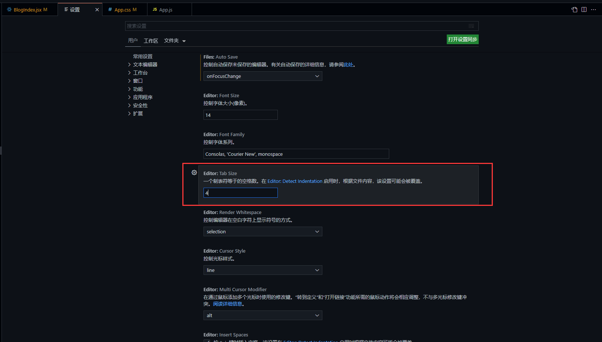

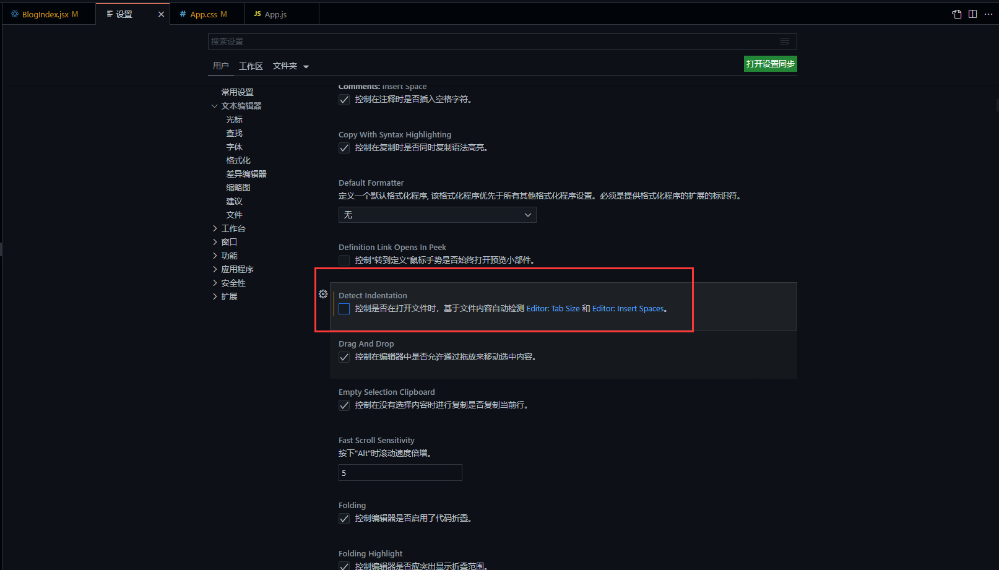

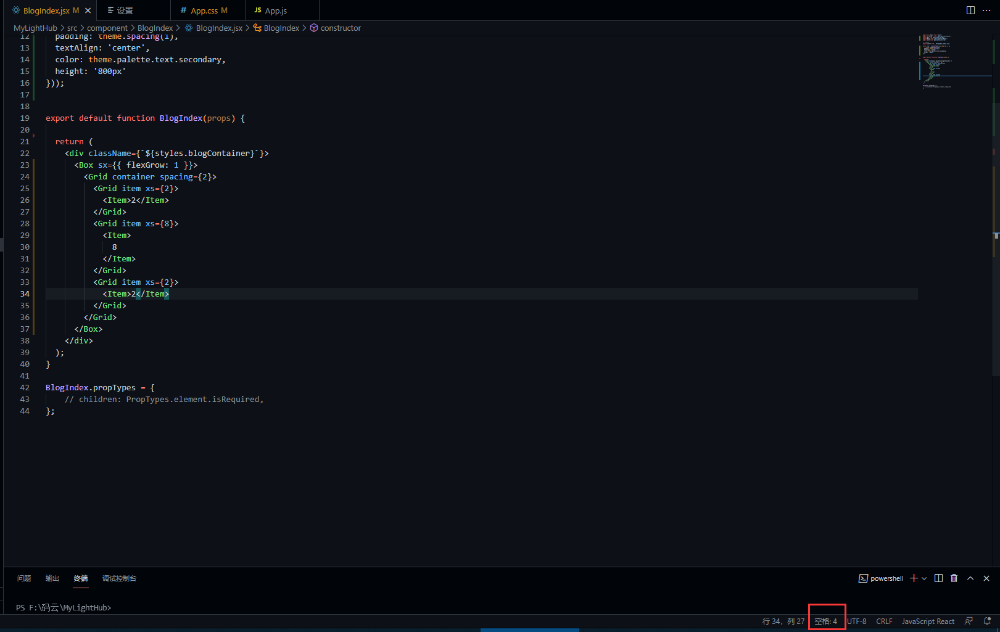

## 格式化代码

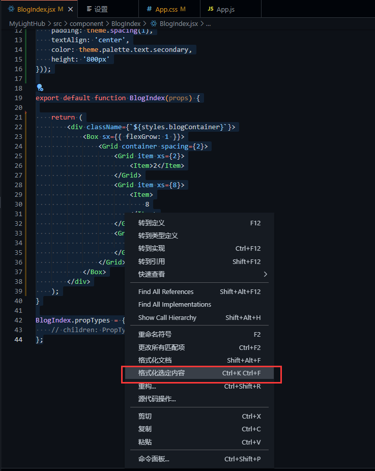

## 大小写转换快捷键

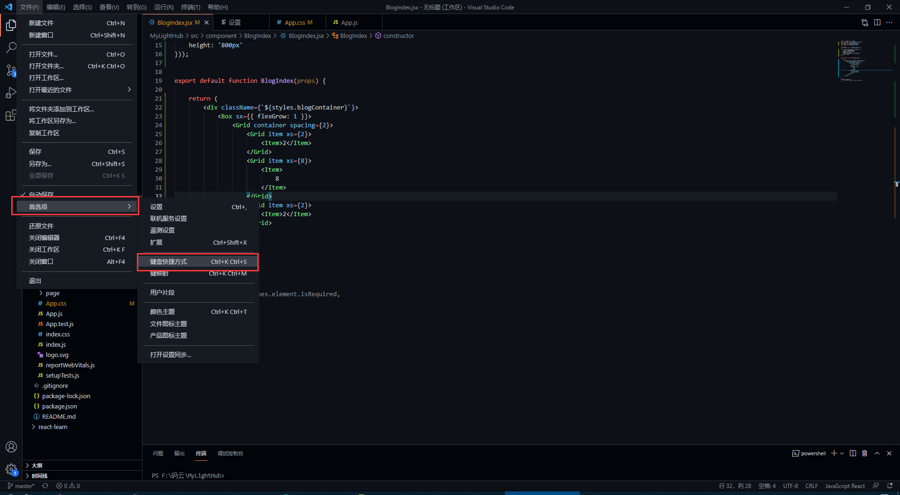

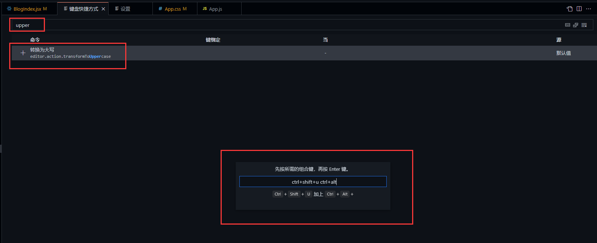

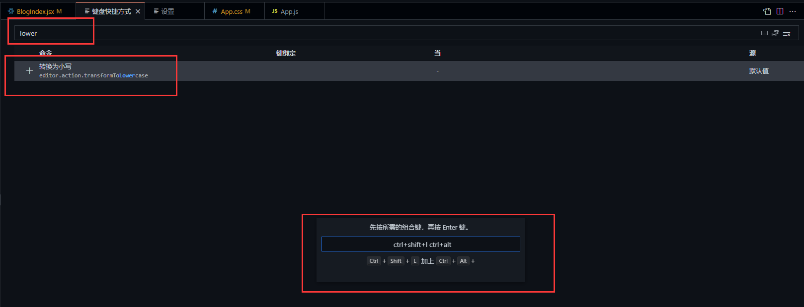

# 正则表达式

注意：正则表达式用在代码中需要多加一根`\`来转义，表达式中的\d要写成 `\\d`。

## 数字相关

```
1. 数字：^[0-9]*$

2. n位的数字：^\d{n}$

3. 至少n位的数字：^\d{n,}$

4. m-n位的数字：^\d{m,n}$

5. 零和非零开头的数字：^(0|[1-9][0-9]*)$

6. 非零开头的最多带两位小数的数字：^([1-9][0-9]*)+(.[0-9]{1,2})?$

7. 带1-2位小数的正数或负数：^(\-)?\d+(\.\d{1,2})?$

8. 正数、负数、和小数：^(\-|\+)?\d+(\.\d+)?$

9. 有两位小数的正实数：^[0-9]+(.[0-9]{2})?$

10. 有1~3位小数的正实数：^[0-9]+(.[0-9]{1,3})?$

11. 非零的正整数：^[1-9]\d*$ 或 ^([1-9][0-9]*){1,3}$ 或 ^\+?[1-9][0-9]*$

12. 非零的负整数：^\-[1-9][]0-9"*$ 或 ^-[1-9]\d*$

13. 非负整数：^\d+$ 或 ^[1-9]\d*|0$

14. 非正整数：^-[1-9]\d*|0$ 或 ^((-\d+)|(0+))$

15. 非负浮点数：^\d+(\.\d+)?$ 或 ^[1-9]\d*\.\d*|0\.\d*[1-9]\d*|0?\.0+|0$

16. 非正浮点数：^((-\d+(\.\d+)?)|(0+(\.0+)?))$ 或 ^(-([1-9]\d*\.\d*|0\.\d*[1-9]\d*))|0?\.0+|0$

17. 正浮点数：^[1-9]\d*\.\d*|0\.\d*[1-9]\d*$ 或 ^(([0-9]+\.[0-9]*[1-9][0-9]*)|([0-9]*[1-9][0-9]*\.[0-9]+)|([0-9]*[1-9][0-9]*))$

18. 负浮点数：^-([1-9]\d*\.\d*|0\.\d*[1-9]\d*)$ 或 ^(-(([0-9]+\.[0-9]*[1-9][0-9]*)|([0-9]*[1-9][0-9]*\.[0-9]+)|([0-9]*[1-9][0-9]*)))$

19. 浮点数：^(-?\d+)(\.\d+)?$ 或 ^-?([1-9]\d*\.\d*|0\.\d*[1-9]\d*|0?\.0+|0)$
```


## 字符串相关

```
1. 汉字：^[\u4e00-\u9fa5]{0,}$

2. 英文和数字：^[A-Za-z0-9]+$ 或 ^[A-Za-z0-9]{4,40}$

3. 长度为3-20的所有字符：^.{3,20}$

4. 由26个英文字母组成的字符串：^[A-Za-z]+$

5. 由26个大写英文字母组成的字符串：^[A-Z]+$

6. 由26个小写英文字母组成的字符串：^[a-z]+$

7. 由数字和26个英文字母组成的字符串：^[A-Za-z0-9]+$

8. 由数字、26个英文字母或者下划线组成的字符串：^\w+$ 或 ^\w{3,20}$

9. 中文、英文、数字包括下划线：^[\u4E00-\u9FA5A-Za-z0-9_]+$

10. 中文、英文、数字但不包括下划线等符号：^[\u4E00-\u9FA5A-Za-z0-9]+$ 或 ^[\u4E00-\u9FA5A-Za-z0-9]{2,20}$

11. 可以输入含有^%&',;=?$\"等字符：[^%&',;=?$\x22]+ 12 禁止输入含有~的字符：[^~\x22]+
```


## 特殊需求

```
1. Email地址：^\w+([-+.]\w+)*@\w+([-.]\w+)*\.\w+([-.]\w+)*$

2. 域名：[a-zA-Z0-9][-a-zA-Z0-9]{0,62}(/.[a-zA-Z0-9][-a-zA-Z0-9]{0,62})+/.?

3. InternetURL：[a-zA-z]+://[^\s]* 或 ^http://([\w-]+\.)+[\w-]+(/[\w-./?%&=]*)?$

4. 手机号码：^(13[0-9]|14[5|7]|15[0|1|2|3|5|6|7|8|9]|18[0|1|2|3|5|6|7|8|9])\d{8}$

4.微信号：^[a-zA-Z][a-zA-Z\d_-]{5,19}$

5. 电话号码("XXX-XXXXXXX"、"XXXX-XXXXXXXX"、"XXX-XXXXXXX"、"XXX-XXXXXXXX"、"XXXXXXX"和"XXXXXXXX)：^(\(\d{3,4}-)|\d{3.4}-)?\d{7,8}$

6. 国内电话号码(0511-4405222、021-87888822)：\d{3}-\d{8}|\d{4}-\d{7}

7.  身份证号码为15位或者18位，15位时全为数字，18位前17位为数字，最后一位是校验位，可能为数字或字符X：^\d{15}$)|(^\d{18}$)|(^\d{17}(\d|X|x)$

 

8. 短身份证号码(数字、字母x结尾)：^([0-9]){7,18}(x|X)?$ 或 ^\d{8,18}|[0-9x]{8,18}|[0-9X]{8,18}?$

 

9. 帐号是否合法(字母开头，允许5-16字节，允许字母数字下划线)：^[a-zA-Z][a-zA-Z0-9_]{4,15}$

 

10. 密码(以字母开头，长度在6~18之间，只能包含字母、数字和下划线)：^[a-zA-Z]\w{5,17}$

11. 强密码(必须包含大小写字母和数字的组合，不能使用特殊字符，长度在8-10之间)：^(?=.*\d)(?=.*[a-z])(?=.*[A-Z]).{8,10}$

 

12. 日期格式：^\d{4}-\d{1,2}-\d{1,2}

13. 一年的12个月(01～09和1～12)：^(0?[1-9]|1[0-2])$

14. 一个月的31天(01～09和1～31)：^((0?[1-9])|((1|2)[0-9])|30|31)$

15. 钱的输入格式：

 

16. 1.有四种钱的表示形式我们可以接受:"10000.00" 和 "10,000.00", 和没有 "分" 的 "10000" 和 "10,000"：^[1-9][0-9]*$

 

17. 2.这表示任意一个不以0开头的数字,但是,这也意味着一个字符"0"不通过,所以我们采用下面的形式：^(0|[1-9][0-9]*)$

 

18. 3.一个0或者一个不以0开头的数字.我们还可以允许开头有一个负号：^(0|-?[1-9][0-9]*)$

 

19. 4.这表示一个0或者一个可能为负的开头不为0的数字.让用户以0开头好了.把负号的也去掉,因为钱总不能是负的吧.下面我们要加的是说明可能的小数部分：^[0-9]+(.[0-9]+)?$

 

20. 5.必须说明的是,小数点后面至少应该有1位数,所以"10."是不通过的,但是 "10" 和 "10.2" 是通过的：^[0-9]+(.[0-9]{2})?$

 

21. 6.这样我们规定小数点后面必须有两位,如果你认为太苛刻了,可以这样：^[0-9]+(.[0-9]{1,2})?$

 

22. 7.这样就允许用户只写一位小数.下面我们该考虑数字中的逗号了,我们可以这样：^[0-9]{1,3}(,[0-9]{3})*(.[0-9]{1,2})?$

 

23 8.1到3个数字,后面跟着任意个 逗号+3个数字,逗号成为可选,而不是必须：^([0-9]+|[0-9]{1,3}(,[0-9]{3})*)(.[0-9]{1,2})?$

 

24. 备注：这就是最终结果了,别忘了"+"可以用"*"替代如果你觉得空字符串也可以接受的话(奇怪,为什么?)最后,别忘了在用函数时去掉去掉那个反斜杠,一般的错误都在这里

 

25. xml文件：^([a-zA-Z]+-?)+[a-zA-Z0-9]+\\.[x|X][m|M][l|L]$

26. 中文字符的正则表达式：[\u4e00-\u9fa5]

 

27. 双字节字符：[^\x00-\xff] (包括汉字在内，可以用来计算字符串的长度(一个双字节字符长度计2，ASCII字符计1))

 

28. 空白行的正则表达式：\n\s*\r (可以用来删除空白行)

 

29. HTML标记的正则表达式：<(\S*?)[^>]*>.*?</\1>|<.*? /> (网上流传的版本太糟糕，上面这个也仅仅能部分，对于复杂的嵌套标记依旧无能为力)

 

30. 首尾空白字符的正则表达式：^\s*|\s*$或(^\s*)|(\s*$) (可以用来删除行首行尾的空白字符(包括空格、制表符、换页符等等)，非常有用的表达式)

 

31. 腾讯QQ号：[1-9][0-9]{4,} (腾讯QQ号从10000开始)

32. 中国邮政编码：[1-9]\d{5}(?!\d) (中国邮政编码为6位数字)

33. IP地址：\d+\.\d+\.\d+\.\d+ (提取IP地址时有用)

34. IP地址：((?:(?:25[0-5]|2[0-4]\\d|[01]?\\d?\\d)\\.){3}(?:25[0-5]|2[0-4]\\d|[01]?\\d?\\d))
```


