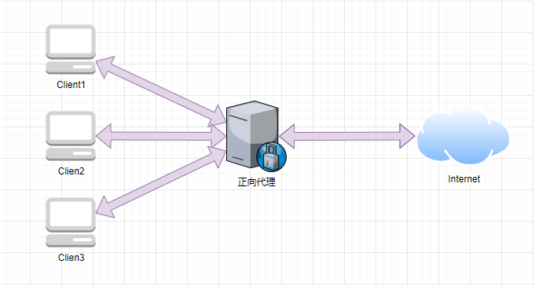
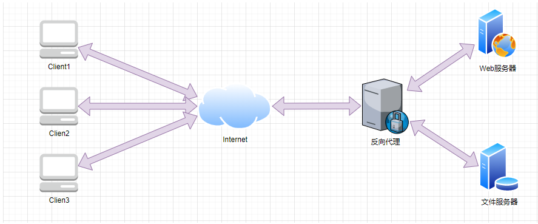

# Nginx笔记

## 正向代理和反向代理

- 正向代理
  - 是一个位于客户端和原始服务器(origin server)之间的服务器。
  - 为了从原始服务器取得内容，客户端向代理发送一个请求并指定目标(原始服务器)，然后代理向原始服务器转交请求并将获得的内容返回给客户端。
  - 代理的是客户端。
  - 作用：==隐藏了真实的客户端==。客户端请求的服务都被代理服务器代替来请求。
  - 
- 反向代理
  - 位于用户与目标服务器之间。
  - 对于用户而言，反向代理服务器就相当于目标服务器，即用户直接访问反向代理服务器就可以获得目标服务器的资源。
  - 代理的是目标服务器。
  - 作用：==隐藏了真实的服务器地址==，提高了内部服务器的安全、提高访问速度、负载均衡。
  - 

- 二者区别
  - 两者的区别在于代理的对象不一样：正向代理代理的对象是客户端，反向代理代理的对象是服务端。

## Nginx是什么

- 官方文档：https://www.nginx.cn/doc/

- *Nginx* (engine x) 是一个高性能的[HTTP](https://baike.baidu.com/item/HTTP)和[反向代理](https://baike.baidu.com/item/反向代理/7793488)web服务器及[电子邮件](https://baike.baidu.com/item/电子邮件/111106)代理服务器。
- 其特点是占有内存少，[并发](https://baike.baidu.com/item/并发/11024806)能力强。
- 常用功能：Http代理、反向代理、负载均衡、web缓存。

## 安装

## 运行

## 反向代理

## 负载均衡