# 目录

- [目录](#目录)
- [SpringBoot](#springboot)
  - [Mysql](#mysql)
    - [连接mysql](#连接mysql)
    - [字段、属性对应关系](#字段属性对应关系)
    - [时间自动填充与更新](#时间自动填充与更新)
  - [Druid](#druid)
    - [依赖](#依赖)
    - [配置连接池和监控](#配置连接池和监控)
  - [MyBatis](#mybatis)
    - [插入并返回主键id](#插入并返回主键id)
    - [Integer 类型值为零时默认为空字符串](#integer-类型值为零时默认为空字符串)
    - [insert语句带条件判断](#insert语句带条件判断)
    - [Update语句使用Select结果集作条件实现动态修改](#update语句使用select结果集作条件实现动态修改)
  - [MybatisPlus](#mybatisplus)
    - [插入成功主键id自动回填](#插入成功主键id自动回填)
    - [service注入其它mapper](#service注入其它mapper)
  - [JPA](#jpa)
    - [按时间查询最近一条记录](#按时间查询最近一条记录)
  - [SpringBoot配置文件](#springboot配置文件)
    - [时间差8小时](#时间差8小时)
    - [限制文件上传大小](#限制文件上传大小)
  - [模板引擎](#模板引擎)
    - [Themleaf](#themleaf)
  - [参数校验](#参数校验)
    - [Validation](#validation)
  - [日志](#日志)
    - [Sl4j日志](#sl4j日志)
  - [前后端交互](#前后端交互)
    - [跨域配置](#跨域配置)
    - [通用响应](#通用响应)
    - [前后端传参](#前后端传参)
  - [异常](#异常)
    - [回滚](#回滚)
    - [捕获指定消息的异常](#捕获指定消息的异常)
    - [统一异常处理](#统一异常处理)
  - [拦截器](#拦截器)
  - [单元测试](#单元测试)
  - [注解](#注解)
    - [@PathVariable](#pathvariable)
    - [@RequestParam](#requestparam)
    - [@RequestBody](#requestbody)
    - [@DateTimeFormat](#datetimeformat)
    - [@JsonFormat](#jsonformat)
    - [@Value](#value)
    - [@JsonSerialize](#jsonserialize)
    - [@ControllerAdvice](#controlleradvice)
    - [@PropertySource注解](#propertysource注解)
  - [重要类](#重要类)
    - [MultipartFile](#multipartfile)
      - [概述](#概述)
      - [接口方法](#接口方法)
      - [MultipartFile转File](#multipartfile转file)
    - [@ControllerAdvice](#controlleradvice-1)
    - [HttpMessageConverter< T >](#httpmessageconverter-t-)
    - [ResponseBodyAdvice](#responsebodyadvice)
    - [RequestBodyAdvice](#requestbodyadvice)
  - [三方工具](#三方工具)
    - [FIleUtils](#fileutils)
      - [依赖](#依赖-1)
      - [下载网络文件](#下载网络文件)
      - [通过URL获取本地文件](#通过url获取本地文件)
    - [HuTools工具包](#hutools工具包)
      - [依赖](#依赖-2)
      - [通过网络资源url字符串获取输入流](#通过网络资源url字符串获取输入流)
      - [将日期字符串转为标准yyyy-MM-dd HH:mm:ss格式](#将日期字符串转为标准yyyy-mm-dd-hhmmss格式)
    - [MapStruct](#mapstruct)
      - [依赖](#依赖-3)
      - [基本使用](#基本使用)
      - [字符串与日期](#字符串与日期)
      - [字符串与布尔](#字符串与布尔)
      - [使用java代码调用静态方法](#使用java代码调用静态方法)
      - [常见问题](#常见问题)
    - [EasyExcel](#easyexcel)
      - [读取的数据全为null](#读取的数据全为null)
  - [格式规范](#格式规范)
    - [PO、VO、DTO](#povodto)
      - [概念](#概念)
      - [VO入参](#vo入参)
      - [VO序列化](#vo序列化)
- [Java](#java)
  - [集合](#集合)
    - [集合与null](#集合与null)
    - [HashMap初始容量设置](#hashmap初始容量设置)
  - [Stream流](#stream流)
    - [map](#map)
    - [filter](#filter)
    - [anyMatch](#anymatch)
    - [toMap](#tomap)
  - [枚举类](#枚举类)
    - [定义与使用](#定义与使用)
    - [根据实例属性获取实例](#根据实例属性获取实例)
  - [正则](#正则)
- [Bug](#bug)
  - [【bug】No converter found...](#bugno-converter-found)
  - [【bug】通用响应时返回类型为String时会报强转错误](#bug通用响应时返回类型为string时会报强转错误)
  - [【bug】数据表名不能为order](#bug数据表名不能为order)

# SpringBoot

## Mysql

### 连接mysql

驱动区别：

```java
// mysql 5 驱动: 
com.mysql.jdbc.Driver

// mysql 8 驱动: 
com.mysql.cj.jdbc.Driver
需添加时区配置 serverTimezone=GMT%2B8
```

properties配置：

```properties
spring.datasource.url=jdbc:mysql://localhost:3306/dataBaseName?useSSL=false&useUnicode=true&characterEncoding=utf-8&serverTimezone=GMT%2B8
spring.datasource.driver-class-name=com.mysql.cj.jdbc.Driver
spring.datasource.username=xxxx
spring.datasource.password=xxxx
```

yml配置：

```yml
spring:
  datasource:
    url: jdbc:mysql://localhost:3306/dataBaseName?userSSL=true&useUnicode=true&characterEncoding=UTF-8&serverTimezone=GMT%2B8&allowMultiQueries=true
    driver-class-name: com.mysql.cj.jdbc.Driver
    username: root
    password: 123456
```

### 字段、属性对应关系

1、Boolean与tinyint：

```java
/** 
MYSQL 保存 BOOLEAN 值时，用 1 代表 TRUE（true）,0 代表 FALSE（false），boolean 在 MySQL 里的类型为 tinyint(1)，对应的实体类中，字段使用Boolean修饰；
*/
```

2、LocalDateTime与datetime：

```java
/**
时间值实体类使用LocalDateTime类型，mysql中对应datetime类型，datetime包括年月日时分秒；
*/
```

3、枚举与varchar

```java
/**
实体类使用枚举类型，mysql中对应varchar类型，在存储数据库时枚举会自动转为String存储，相当于就是字符串；
*/
```

### 时间自动填充与更新

1、数据库级别：

- 在表中添加这样两个字段表示创建时间gmt_create和修改时间gmt_modified；
- 两个字段的默认值为当前的时间戳，gmt_create字段设置为不更新，gmt_modified字段设置为根据当前时间戳`CURRENT_TIMESTAMP`更新；

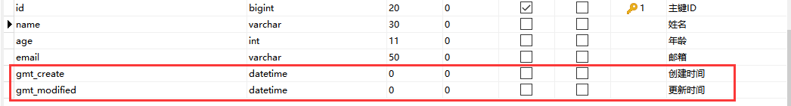

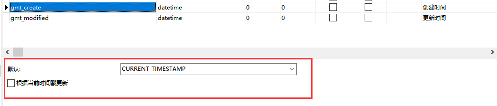

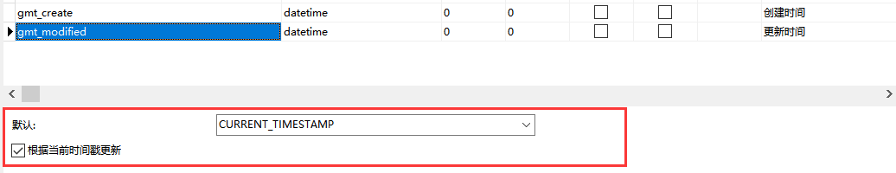

2、程序级别：

- 使用Mybatisplus控制，具体参考[MyBatisPlus文档-自动填充](https://baomidou.com/guide/auto-fill-metainfo.html)；

## Druid

### 依赖

```xml
<!--数据库-->
<dependency>
    <groupId>mysql</groupId>
    <artifactId>mysql-connector-java</artifactId>
    <scope>runtime</scope>
</dependency>

<!--数据库连接池-->
<dependency>
    <groupId>com.alibaba</groupId>
    <artifactId>druid-spring-boot-starter</artifactId>
    <version>1.1.10</version>
</dependency>
```

### 配置连接池和监控

配置说明参阅官方文档：[DruidDataSource配置属性列表 · alibaba/druid Wiki · GitHub](https://github.com/alibaba/druid/wiki/DruidDataSource配置属性列表)

1、配置文件配置：

```yml
spring:
  application:
    name: pangchun-blog
  datasource:
    type: com.alibaba.druid.pool.DruidDataSource
    platform: mysql
    driver-class-name: com.mysql.cj.jdbc.Driver
    url: jdbc:mysql://localhost:3306/blog?serverTimezone=GMT%2B8&useSSL=false&characterEncoding=UTF-8
    username: root
    password: 111111
    druid:
      filters: stat
      #最大连接池数量
      max-active: 200
      #初始化时建立物理连接的个数
      initial-size: 10
      #获取连接时最大等待时间，单位毫秒
      max-wait: 60000
      #最小连接池数量
      min-idle: 10
      time-between-eviction-runs-millis: 60000
      min-evictable-idle-time-millis: 300000
      validation-query: select 1
      #validation-query: select 1 from dual
      test-while-idle: true
      test-on-borrow: false
      test-on-return: false
      #是否缓存preparedStatement
      pool-prepared-statements: true
      #要启用PSCache，必须配置大于0
      max-open-prepared-statements: 200
      break-after-acquire-failure: true
      time-between-connect-error-millis: 300000
      # 下面3个enabled改为true即开启druid monitor
      filter:
        config:
          enabled: false
      # 配置 DruidStatFilter
      web-stat-filter:
        enabled: false
        url-pattern: /*
        exclusions: .js,*.gif,*.jpg,*.bmp,*.png,*.css,*.ico,/druid/*
      # 配置 DruidStatViewServlet
      stat-view-servlet:
        enabled: false
        url-pattern: /druid/*
        # IP 白名单，没有配置或者为空，则允许所有访问
        allow:
        # IP 黑名单，若白名单也存在，则优先使用
        deny:
        # 禁用 HTML 中 Reset All 按钮
        reset-enable: false
        # 登录用户名/密码
        login-username: root
        login-password: 12346
```

2、配置类配置（推荐）：

```java
package com.pangchun.blog.Druid;
import javax.sql.DataSource;

import org.springframework.boot.context.properties.ConfigurationProperties;
import org.springframework.boot.web.servlet.FilterRegistrationBean;
import org.springframework.boot.web.servlet.ServletRegistrationBean;
import org.springframework.context.annotation.Bean;
import org.springframework.context.annotation.Configuration;

import com.alibaba.druid.pool.DruidDataSource;
import com.alibaba.druid.support.http.StatViewServlet;
import com.alibaba.druid.support.http.WebStatFilter;

@Configuration
public class DruidConfig {

    /**
     * 注入配置文件配置的数据源属性
     *
     * @return
     */
    @Bean
    @ConfigurationProperties(prefix = "spring.datasource")
    public DataSource druidDataSource() {
        return new DruidDataSource();
    }

    /**
     * 主要实现web监控的配置处理
     *
     * @return
     */
    @Bean
    public ServletRegistrationBean druidServlet() {
        //表示进行druid监控的配置处理操作
        ServletRegistrationBean servletRegistrationBean = new ServletRegistrationBean(new StatViewServlet(), "/druid/*");
        //白名单
        servletRegistrationBean.addInitParameter("allow", "127.0.0.1,129.168.1.11");
        //黑名单
        servletRegistrationBean.addInitParameter("deny", "129.168.1.12");
        //用户名
        servletRegistrationBean.addInitParameter("loginUsername", "root");
        //密码
        servletRegistrationBean.addInitParameter("loginPassword", "root");
        //是否可以重置数据源
        servletRegistrationBean.addInitParameter("resetEnable", "false");
        return servletRegistrationBean;

    }

    /**
     * 监控请求
     *
     * @return
     */
    @Bean
    public FilterRegistrationBean filterRegistrationBean(){
        FilterRegistrationBean filterRegistrationBean=new FilterRegistrationBean();
        filterRegistrationBean.setFilter(new WebStatFilter());
        //所有请求进行监控处理
        filterRegistrationBean.addUrlPatterns("/*");
        //排除
        filterRegistrationBean.addInitParameter("exclusions", "*.js,*.gif,*.jpg,*.css,/druid/*");
        return filterRegistrationBean;
    }
}
```

使用配置类配置时，配置文件不需要配置以下内容：

```yml
      # 下面3个enabled改为true即开启druid monitor
      filter:
        config:
          enabled: false
      # 配置 DruidStatFilter
      web-stat-filter:
        enabled: false
        url-pattern: /*
        exclusions: .js,*.gif,*.jpg,*.bmp,*.png,*.css,*.ico,/druid/*
      # 配置 DruidStatViewServlet
      stat-view-servlet:
        enabled: false
        url-pattern: /druid/*
        # IP 白名单，没有配置或者为空，则允许所有访问
        allow:
        # IP 黑名单，若白名单也存在，则优先使用
        deny:
        # 禁用 HTML 中 Reset All 按钮
        reset-enable: false
        # 登录用户名/密码
        login-username: root
        login-password: 12346
```

3、注解配置：

暂时未用上，需要可参考：https://my.oschina.net/wuaiting/blog/3164909

## MyBatis

### 插入并返回主键id

配置`useGeneratedKeys="true" keyProperty="goodsId"`，在`GoodsAddDTO`中需要有goodsId主键，返回的主键id会设置到goodsId中。

```xml
<insert id="addGoods" parameterType="GoodsAddDTO" useGeneratedKeys="true" keyProperty="goodsId">
    insert into goods(goods_name, produce_place, remain_number, goods_size, fresh_time, storage_id, total_number)
    values (#{goodsName}, #{producePlace},#{number}, #{goodsSize}, #{freshTime}, #{storageId}, #{number})
</insert>
```

### Integer 类型值为零时默认为空字符串

```xml
<!-- mybatis规定Integer类型值为0时会当作空字符串 -->
<if test="status != null and status != '' or status == 0">
    and l.status = #{status}
</if>
```

**解决办法**

1、方法一：去掉`<if test="status!= null and status!= ''">`中的and status!= ”：

```xml
<if test="status != null">
```

2、方法二：在 `<if test="status!= null and status!= ''">`中加入or status==0：

```xml
<if test="status != null and status != ''  or status==0">
```

### insert语句带条件判断

为了不插入重复记录，两种方法

1、数据库表添加唯一索引

2、在insert语句中判断条件

```xml
<!-- 新增仓库 如果仓库名已存在，新增失败！ -->
<insert id="addStorage" parameterType="StorageAddDTO">
    insert into storage(storage_name, storage_real_place)
    select #{storageName}, #{storageRealPlace} from dual where not exists(select storage_name from storage where storage_name = #{storageName})
</insert>
```

`dual`是一个临时表，参数先全部放在表dual中，通过判断` where not exists(select storage_name from storage where storage_name = #{storageName})`是否存在满足条件的记录，如果不存在，才会将参数从dual取出给insert语句插入。

### Update语句使用Select结果集作条件实现动态修改

```mysql
<!-- 修改仓库 如果仓库中存在同名，则不能修改 -->
<update id="edit" parameterType="Storage">
    update storage as s1
    inner join (select count(*) as "theSameCount" from storage s where s.id != #{id} and s.storage_name = #{storageName}) as s2
    set s1.storage_name = #{storageName} ,s1.storage_real_place = #{storageRealPlace}
    where s1.id = #{id} and s2.theSameCount = 0
</update>
```

```mysql
<!-- 编辑员工信息 -->
<update id="editUser" parameterType="UserEditDTO">
    update user
    inner join (select count(*) as "theSameCount" from user where id != #{userId} and username = #{username}) as u
    <set>
        <if test="username != null and username != ''">username=#{username},</if>
        <if test="password != null and password != ''">password = MD5(#{password}), </if>
        <if test="telephone != null and telephone != ''">telephone=#{telephone},</if>
        <if test="post != null and post != ''">post=#{post}</if>
    </set>
    <where>
        <if test="true">
            id = #{userId}
        </if>
        <if test="username != null and username != ''">
            and u.theSameCount = 0
        </if>
    </where>
</update>
```

## MybatisPlus

### 插入成功主键id自动回填

调save(Entity e)方法时，主键id已经更新到e中了，可以直接拿到。

### service注入其它mapper

1. AService只能注入AMapper和BService，不能注入BMapper；
2. 注入mapper要使用@Resource注解；

## JPA

### 按时间查询最近一条记录

通过方法命名查询可以快速解决这个问题，利用关键字 `Top` *and* `First`；

示例：（[参考文档](https://docs.spring.io/spring-data/jpa/docs/2.0.0.RC2/reference/html/#repositories.limit-query-result)）

```java
User findFirstByOrderByLastnameAsc();

User findTopByOrderByAgeDesc();

Page<User> queryFirst10ByLastname(String lastname, Pageable pageable);

Slice<User> findTop3ByLastname(String lastname, Pageable pageable);

List<User> findFirst10ByLastname(String lastname, Sort sort);

List<User> findTop10ByLastname(String lastname, Pageable pageable);
```

## SpringBoot配置文件

### 时间差8小时

```yml
# 配置时区为东八区
spring:
  jackson:
    time-zone: GMT+8
```

原因：

默认情况下在使用spring的@ResponseBody返回json串时，如果有日期类型的数据，会发现在日期会莫名其妙的差8小时，比如：2017-12-20 10:16:23.0，结果是：2017-12-20 02:16:23；

因为spring转json的默认实现jackson中会根据时区去转换时间，而jackson的默认时区跟
国内应该是相差8小时，所以在时间换算上自动减去了8小时；

### 限制文件上传大小

spring对于文件上传大小的限制：每个文件的最大为1Mb，单次请求的文件的总数大小不能大于10Mb，否则报FileSizeLimitExceededException，通过以下配置修改：

```yml
spring:
  servlet:
    multipart:
      max-file-size: 100MB # 每个文件最大100M
      max-request-size: -1 # 每次请求文件总量最大不受限
```

## 模板引擎

### Themleaf


## 参数校验

### Validation

1、依赖：

```xml
<!--validation参数校验-->
<dependency>
    <groupId>org.springframework.boot</groupId>
    <artifactId>spring-boot-starter-validation</artifactId>
</dependency>
```

2、实体类添加校验注解：

```java
@Data
public class TestParam {
    @NotEmpty(message = "不为null并且不为空")
    private String code;

    @NotBlank(message = "不为null并且包含至少一个非空白字符")
    private String msg;
}
```

3、Controller中添加@Validated和用于接收错误信息的BindingResult：

校验实体类的属性：

当校验的是实体类的属性时，@Validated要放在接口中入参的前面才会生效；

```java
@RestController
public class ValidationController {

    @GetMapping(value = "/api")
    public String methodName(@Validated TestParam testParam, BindingResult result) {
        List<FieldError> fieldErrors = result.getFieldErrors();
        if(!fieldErrors.isEmpty()){
            // 返回错误信息
            return fieldErrors.get(0).getField()+":"+fieldErrors.get(0).getDefaultMessage();
        }
        return testParam.toString();
    }
}
```

校验入参：

当校验的是入参时，@Validated要放在类上才会生效；

```java
@RestController
@Validated
public class ValidationController {

    @GetMapping(value = "/api")
    public void methodName(@Email String s) {
        
    }
}
```

4、常用注解：

| 注解             | 描述                               |
| ---------------- | ---------------------------------- |
| @AssertFalse     | 必须是false                        |
| @AssertTrue      | 必须是true                         |
| @DecimalMax      | 小于等于给定的值                   |
| @DecimalMin      | 大于等于给定的值                   |
| @Digits          | 可设定最大整数位数和最大小数位数   |
| @Email           | 校验是否符合Email格式              |
| @Future          | 必须是将来的时间                   |
| @FutureOrPresent | 当前或将来时间                     |
| @Max             | 最大值                             |
| @Min             | 最小值                             |
| @Negative        | 负数（不包括0）                    |
| @NegativeOrZero  | 负数或0                            |
| @NotBlank        | 不为null并且包含至少一个非空白字符 |
| @NotEmpty        | 不为null并且不为空                 |
| @NotNull         | 不为null                           |
| @Null            | 为null                             |
| @Past            | 必须是过去的时间                   |
| @PastOrPresent   | 必须是过去的时间，包含现在         |
| @PositiveOrZero  | 正数或0                            |
| @Size            | 校验容器的元素个数                 |

## 日志

### Sl4j日志

1、导入依赖：

```xml
<!--  sl4j -->
<dependency>
    <groupId>org.slf4j</groupId>
    <artifactId>slf4j-log4j12</artifactId>
    <version>1.7.28</version>
</dependency>

<!-- fastjson：方便打印日志 -->
<dependency>
    <groupId>com.alibaba</groupId>
    <artifactId>fastjson</artifactId>
    <version>1.2.66</version>
</dependency>
```

2、添加配置文件log4j.properties：

```properties
# 配置文件位置：maven项目在resources目录下添加，普通java项目在src目录下添加

log4j.rootLogger=debug,A,R

log4j.appender.logfile.encoding=UTF-8

log4j.appender.R=org.apache.log4j.DailyRollingFileAppender

log4j.appender.R.File=F:/所有应用的下载文件夹/POI&EasyExcel/excel-demo/src/main/resources/logFile.log

log4j.appender.R.layout.ConversionPattern=%-d{yyyy-MM-dd HH\:mm\:ss} [%c]-[%p] %m%n

log4j.appender.R.DatePattern='.'yyyy-MM-dd

log4j.appender.R.layout=org.apache.log4j.PatternLayout

log4j.appender.A=org.apache.log4j.ConsoleAppender
log4j.appender.A.layout=org.apache.log4j.PatternLayout
log4j.appender.A.layout.ConversionPattern=%d{yyyy-MM-dd HH:mm:ss} [%c]-[%p] %m%n
```

注意：如果配置后发现代码运行有没有日志的文件，请检查编码格式并设置为utf-8；

3、使用方式：

```java
private static final Logger Log = LoggerFactory.getLogger(PersonDataListener.class);

Log.info("解析到一个person对象{}", JSON.toJSONString(person));
```

## 前后端交互

### 跨域配置

1、后端配置：

```java
package com.lixue.admin.common.config;

import org.springframework.context.annotation.Bean;
import org.springframework.context.annotation.Configuration;
import org.springframework.core.annotation.Order;
import org.springframework.web.cors.CorsConfiguration;
import org.springframework.web.cors.UrlBasedCorsConfigurationSource;
import org.springframework.web.filter.CorsFilter;

/**
 * 解决跨域问题
 *
 * 参考：https://segmentfault.com/a/1190000018018849
 */
@Configuration
/**
 * 注解@Order或者接口Ordered的作用是：
 * 定义Spring IOC容器中Bean的执行顺序的优先级，而不是定义Bean的加载顺序，
 * Bean的加载顺序不受@Order或Ordered接口的影响；
 */
@Order(1)
public class FilterConfig {
    private CorsConfiguration buildConfig(){
        CorsConfiguration corsConfiguration = new CorsConfiguration();
        corsConfiguration.addAllowedHeader("*"); // 允许任何的head头部
        //corsConfiguration.addAllowedOrigin("*"); // 允许任何域名使用
        corsConfiguration.addAllowedOriginPattern("*"); // 允许任何域名使用
        corsConfiguration.addAllowedMethod("*"); // 允许任何的请求方法
        corsConfiguration.setAllowCredentials(true);
        return corsConfiguration;
    }
    // 添加CorsFilter拦截器，对任意的请求使用
    @Bean
    public CorsFilter corsFilter() {
        UrlBasedCorsConfigurationSource source = new UrlBasedCorsConfigurationSource();
        source.registerCorsConfiguration("/**", buildConfig());
        return new CorsFilter(source);
    }
}
```

2、前端配置：

前后端分离跨域时，Cookie、Session会丢失，前端ajax请求需配置：

```js
/*设置跨域支持*/
xhrFields: {withCredentials: true},
crossDomain: true 

//若是使用Layui等框架，需要在源码中的ajax请求中添加以上配置。
//参考：https://blog.csdn.net/weixin_43895377/article/details/93185868
```

### 通用响应

1、统一响应注解：

```java
/**
 * 统一响应格式注解：在控制器类或方法上添加此注解后，可以直接返回数据T，不需要自己手动封装CommonResponse类
 *
 * @author pangchun
 * @since 2021/9/13
 */
@Retention(RetentionPolicy.RUNTIME)
@Target({ElementType.TYPE, ElementType.METHOD})
public @interface CommonResponseBody {
}
```

2、统一响应状态码：

接口：

```java
/**
 * 状态码类型
 *
 * @author pangchun
 * @since 2021/9/12
 */
public interface CodeType {

    /**
     * 状态码
     * @return
     */
    int code();

    /**
     * 状态码消息
     * @return
     */
    String message();
}

```

实现枚举：

```java
import java.util.Arrays;
import java.util.NoSuchElementException;

/**
 * 状态码枚举
 *
 * @author pangchun
 * @since 2021/9/12
 */
public enum CodeEnum implements CodeType {

    /** 成功 */
    SUCCESS(0, "成功"),

    /** 失败 */
    FAIL(-1, "失败"),

    /** 未知 */
    UNKNOWN(1000, "未知错误"),

    /** 认证失败 */
    UNAUTHORIZED(2000, "认证失败"),

    /** 没有权限 */
    FORBIDDEN(3000, "没有权限"),
    ;

    private final int code;

    private final String message;

    CodeEnum(int code, String message) {
        this.code = code;
        this.message = message;
    }

    @Override
    public int code() {
        return this.code;
    }

    @Override
    public String message() {
        return this.message;
    }

    /**
     * 通过code反查枚举
     */
    public static CodeEnum of(int code) {
        return Arrays.stream(CodeEnum.values()).filter(e -> e.code == code).findAny().orElseThrow(() -> new NoSuchElementException("No value present"));
    }
}
```

3、统一响应类：

```java
/**
 * 通用响应
 *
 * @author pangchun
 * @since 2021/9/12
 */
public class CommonResponse<T> {

    /** 状态码 */
    private int code;

    /** 描述信息 */
    private String message;

    /** 返回数据 */
    private T data;

    /**
     * 无参构造
     */
    public CommonResponse() {
    }

    /**
     * 全参构造
     *
     * @param code
     * @param message
     * @param data
     */
    public CommonResponse(int code, String message, T data) {
        this.code = code;
        this.message = message;
        this.data = data;
    }

    /**
     * 成功
     *
     * @param <T>
     * @return
     */
    public static <T> CommonResponse<T> ofSuccess() {
        CommonResponse<T> resp = new CommonResponse<>();
        resp.code = CodeEnum.SUCCESS.code();
        resp.message = CodeEnum.SUCCESS.message();
        return resp;
    }

    /**
     * 成功
     *
     * @param message
     * @param <T>
     * @return
     */
    public static <T> CommonResponse<T> ofSuccess(String message) {
        CommonResponse<T> resp = new CommonResponse<>();
        resp.code = CodeEnum.SUCCESS.code();
        resp.message = message;
        return resp;
    }

    /**
     * 成功
     *
     * @param data
     * @param <T>
     * @return
     */
    public static <T> CommonResponse<T> ofSuccess(T data) {
        CommonResponse<T> resp = ofSuccess();
        resp.data = data;
        return resp;
    }

    /**
     * 成功
     *
     * @param message
     * @param data
     * @param <T>
     * @return
     */
    public static <T> CommonResponse<T> ofSuccess(String message, T data) {
        CommonResponse<T> resp = ofSuccess(message);
        resp.data = data;
        return resp;
    }

    /**
     * 失败
     *
     * @param <T>
     * @return
     */
    public static <T> CommonResponse<T> ofFail() {
        CommonResponse<T> resp = new CommonResponse<>();
        resp.code = CodeEnum.FAIL.code();
        resp.message = CodeEnum.FAIL.message();
        return resp;
    }

    /**
     * 失败
     *
     * @param message
     * @param <T>
     * @return
     */
    public static <T> CommonResponse<T> ofFail(String message) {
        CommonResponse<T> resp = new CommonResponse<>();
        resp.code = CodeEnum.FAIL.code();
        resp.message = message;
        return resp;
    }
}
```

4、统一响应增强类：

```java
import org.springframework.core.MethodParameter;
import org.springframework.core.annotation.AnnotatedElementUtils;
import org.springframework.http.MediaType;
import org.springframework.http.converter.HttpMessageConverter;
import org.springframework.http.server.ServerHttpRequest;
import org.springframework.http.server.ServerHttpResponse;
import org.springframework.web.bind.annotation.RestControllerAdvice;
import org.springframework.web.servlet.mvc.method.annotation.ResponseBodyAdvice;

import java.lang.annotation.Annotation;

/**
 * 统一响应格式增强处理
 *
 * @author pangchun
 * @since 2021/9/13
 */
@RestControllerAdvice
public class CommonResponseAdvice implements ResponseBodyAdvice<Object> {

    /**
     * 注解类型
     */
    private static final Class<? extends Annotation> ANNOTATION_TYPE = CommonResponseBody.class;

    /**
     * 判断类或方法上是否使用了自定义注解 {@link CommonResponseBody}, 是则拦截并进行增强处理
     *
     * @param methodParameter 接口方法返回值参数
     * @param converterType  消息转换器类型
     * @return               如果使用了 {@link CommonResponseBody} 注解，返回true并调用 {@link #beforeBodyWrite} 方法，否则返回false
     */
    @Override
    public boolean supports(MethodParameter methodParameter, Class<? extends HttpMessageConverter<?>> converterType) {
        Class<?> parameterType = methodParameter.getParameterType();
        // 如果返回值为void，则不需要增强处理，直接返回
        if (parameterType.getName().equalsIgnoreCase(void.class.getName())) {
            return false;
        }
        return methodParameter.hasMethodAnnotation(ANNOTATION_TYPE) || AnnotatedElementUtils.hasAnnotation(methodParameter.getContainingClass(), ANNOTATION_TYPE);
    }

    /**
     * 对响应体做一些增强处理
     * @param body 响应体
     * @param methodParameter
     * @param selectedContentType
     * @param selectedConverterType
     * @param request
     * @param response
     * @return
     */
    @Override
    public Object beforeBodyWrite(Object body, MethodParameter methodParameter, MediaType selectedContentType, Class<? extends HttpMessageConverter<?>> selectedConverterType, ServerHttpRequest request, ServerHttpResponse response) {
        System.out.println("已经对拦截到的数据进行增强处理！");
        return CommonResponse.ofSuccess(body);
    }
}
```

5、配置消息转换器：

```java
import org.springframework.context.annotation.Configuration;
import org.springframework.http.converter.HttpMessageConverter;
import org.springframework.http.converter.json.MappingJackson2HttpMessageConverter;
import org.springframework.web.servlet.config.annotation.WebMvcConfigurer;

import java.util.List;

/**
 * web-mvc配置
 *
 * @author pangchun
 * @since 2021/9/13
 */
@Configuration
public class WebMvcConfig implements WebMvcConfigurer {

    /**
     * 配置消息转换器
     * @param converters
     */
    @Override
    public void extendMessageConverters(List<HttpMessageConverter<?>> converters) {
        converters.add(0,new MappingJackson2HttpMessageConverter());

    }
}
```

6、测试类与接口：

```java
// 注意要有setter和getter方法
public class Person {

    private String name;
    private Integer age;

    public Person(String name, Integer age) {
        this.name = name;
        this.age = age;
    }

    public String getName() {
        return name;
    }

    public void setName(String name) {
        this.name = name;
    }

    public Integer getAge() {
        return age;
    }

    public void setAge(Integer age) {
        this.age = age;
    }
}
```

```java
import org.springframework.web.bind.annotation.GetMapping;
import org.springframework.web.bind.annotation.RequestMapping;
import org.springframework.web.bind.annotation.RestController;

@RestController
@RequestMapping("/common")
@CommonResponseBody
public class TestController {

    @GetMapping("/test-void")
    public void testVoid() {
        System.out.println("testVoid()...");
    }

    @GetMapping("/test-person")
    public Person testPerson() {
        System.out.println("testPerson()...");
        return new Person("pangchun", 23);
    }

    @GetMapping("/test-string")
    public String testString() {
        System.out.println("testString()...");
        return "testString";
    }
}
```

### 前后端传参

1、前端传数组，后端list接：（嵌套数组时，一层数组就对应一层list；）

```json
// 前端传参数组如下：
[
	[
		["姓名","年龄","性别"],
		["张三",18,"男"],
		["李四",28,"女"],
	]
]
```

```java
// 后端接口参数如下：
@PostMapping("/import")
public void test(@RequestBody List<List<List<String>>> list) {
    log.info(JSON.toHSONString(list));
}
```

## 异常

### 回滚

1、自动回滚

```java
// 启动类开启事务功能
@EnableTransactionManagement

//方法上添加注解
@Transactional(rollbackFor = Exception.class)
```

2、手动回滚

```java
// 启动类开启事务功能
@EnableTransactionManagement

@Transactional(rollbackFor = Exception.class)
@Override
public void saveEntity() throws Exception{
    Object savePoint = null;
    try {
        userDao.saveUser();
        //设置回滚点
        savePoint = TransactionAspectSupport.currentTransactionStatus().createSavepoint();
        studentDao.saveStudent(); //执行成功
        int a = 10/0; //这里因为除数0会报异常,进入catch块
    }catch (Exception e){
        System.out.println("异常了=====" + e);
        //手工回滚异常
        TransactionAspectSupport.currentTransactionStatus().rollbackToSavepoint(savePoint);
    }
}
```

### 捕获指定消息的异常

```java
class Test {
	public static void main(String[] args) {
		try {
			testException();
		} catch (RuntimeException e) {
			if (e.getMessage().equals("自定义异常消息!")) {
				System.out.println(e.getMessage());
			} else {
				throw e;
			}
		}
	}

    // 异常消息应定义为常量池或枚举，否侧会被认为是魔法值
	public static void testException() {
		//throw new RuntimeException("自定义异常消息!");
		throw new RuntimeException("非自定义异常消息!");
	}
}
```

### 统一异常处理

1、定义异常类：

```java
/**
 * 参数异常
 *
 * @author pangchun
 * @since 2021/9/13
 */
public class ParameterException extends RuntimeException{

    public ParameterException() {
    }

    public ParameterException(String message) {
        super(message);
    }
}
```

2、添加异常状态码枚举PARAMETER_ERROR：

```java
public enum CodeEnum implements CodeType{

    SUCCESS(200, "成功"),
    FAIL(500, "失败"),
    PARAMETER_ERROR(10000, "参数错误"),
    ;

    private final int code;
    private final String message;

    CodeEnum(int code, String message) {
        this.code = code;
        this.message = message;
    }

    @Override
    public int code() {
        return code;
    }

    @Override
    public String message() {
        return message;
    }
}
```

3、统一异常处理：

```java
import org.example.common_respsonse.CodeEnum;
import org.example.common_respsonse.CommonResponse;
import org.springframework.web.bind.annotation.ControllerAdvice;
import org.springframework.web.bind.annotation.ExceptionHandler;
import org.springframework.web.bind.annotation.ResponseBody;

/**
 * 统一异常增强处理
 *
 * @author pangchun
 * @since 2021/9/16
 */
@ControllerAdvice
public class GlobalExceptionHandlerAdvice {

    @ExceptionHandler(ParameterException.class)
    @ResponseBody
    public CommonResponse<String> ParameterExceptionHandle(ParameterException e) {
        e.printStackTrace();
        String message = e.getMessage() == null? CodeEnum.PARAMETER_ERROR.message(): e.getMessage();
        return CommonResponse.ofFail(CodeEnum.PARAMETER_ERROR.code(), message);
    }
}
```

4、抛出异常测试：

当抛出异常时，返回的是我们在处理器中定义的json数据：

```java
@GetMapping("/test-error")
public String testError() {
    System.out.println("testError()...");
    throw new ParameterException("您的参数有误");
}
```

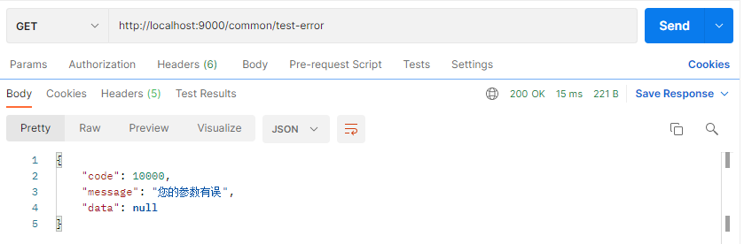

5、关于springboot异常处理的源码解析：

https://blog.csdn.net/weixin_33901843/article/details/91416688

## 拦截器

1、配置拦截器：

```java
package com.lixue.admin.common.componente;

import lombok.extern.slf4j.Slf4j;
import org.springframework.stereotype.Component;
import org.springframework.web.servlet.HandlerInterceptor;
import org.springframework.web.servlet.ModelAndView;
import javax.servlet.http.HttpServletRequest;
import javax.servlet.http.HttpServletResponse;

/**
 * 登录拦截器
 * 拦截所有未登录请求，通过session中是否有用户信息判断。
 */
@Component
@Slf4j
public class LoginHandlerInterceptor implements HandlerInterceptor {
    @Override
    public boolean preHandle(HttpServletRequest request, HttpServletResponse response, Object handler) throws Exception {

        Object user = request.getSession().getAttribute("user");

        if (user == null) {
            //未登录，返回请登录提示
            log.info("未登录被拦截的接口是：" + request.getRequestURI());
            //转发到处理未登录请求接口
            request.getRequestDispatcher("/login-miss").forward(request, response);
            return false;
        } else {
            log.info("session中用户信息：" + user.toString());
            return true;
        }
    }

    @Override
    public void postHandle(HttpServletRequest request, HttpServletResponse response, Object handler, ModelAndView modelAndView) throws Exception {

    }

    @Override
    public void afterCompletion(HttpServletRequest request, HttpServletResponse response, Object handler, Exception ex) throws Exception {

    }
}
```

2、注册拦截器：

```java
package com.lixue.admin.common.config;

import com.lixue.admin.common.componente.LoginHandlerInterceptor;
import org.springframework.context.annotation.Configuration;
import org.springframework.web.servlet.config.annotation.CorsRegistry;
import org.springframework.web.servlet.config.annotation.InterceptorRegistry;
import org.springframework.web.servlet.config.annotation.WebMvcConfigurer;

/**
 * webMVC的自定义配置
 */
@Configuration
public class MvcConfig implements WebMvcConfigurer { 
    
    @Override
    public void addInterceptors(InterceptorRegistry registry) {

        registry.addInterceptor(new LoginHandlerInterceptor())
                .addPathPatterns("/**")
                .excludePathPatterns("/", "/login", "/login-miss", "/error","/swagger-resources/**", "/webjars/**", "/v2/**", "/swagger-ui.html/**");
    }
}
```

##  单元测试

1、添加依赖：

```xml
<!--test-->
<dependency>
    <groupId>org.springframework.boot</groupId>
    <artifactId>spring-boot-starter-test</artifactId>
    <scope>test</scope>
</dependency>

<!--junit-->
<dependency>
    <groupId>junit</groupId>
    <artifactId>junit</artifactId>
    <version>4.12</version>
    <scope>test</scope>
</dependency>
```

2、生成测试类：

```java
import org.junit.Test;
import org.junit.runner.RunWith;
import org.springframework.boot.test.context.SpringBootTest;
import org.springframework.test.context.junit4.SpringRunner;

@RunWith(SpringRunner.class)
@SpringBootTest
public class Test {
  
    @Test
    public void test1() {
        
    }
}
```

注意：

- 快捷键Shift+Alt+T，也可以右键选择generate生成，或者手动写一个测试类；
- 此外，生成的测试类不是public的，测试类和方法都要使用public修饰才会有运行三角形图标；

## 注解

### @PathVariable

1、接口格式：

```java
@GetMapping("/api/{myId}")
public void methodName(@PathVariable("myId") Long id) {...}

// url格式如下：
http://localhost:8080/api/123456
```

URL 中的 {xxx} 占位符可以通过@PathVariable("xxx") 绑定到操作方法的入参中；

### @RequestParam

1、接口格式：

```java
@GetMapping("/api")
public void methodName(@RequestParam("myId") Long id) {...}

// url格式如下：
http://localhost:8081/api?myId=123456
```

@RequestParam注解是从地址栏获取参数，而不是请求体中获取，因此而使用ajax请求时，不需要contentType参数不能设置为application/json；

2、前端Ajax格式：

```js
$.ajax({
        type: "GET",
        url : "/api",
        data: {"myId": myId},
        dataType: "json",
        //contentType: "application/json",
        success: function(result) {...}
```

contentType："application/json"会将请求参数放到请求体body中，那么地址栏就不会带有myId参数了，那么后台获取不到就会报缺少参数错误MissingServletRequestParameterException；

### @RequestBody

加RequestBody和不加的区别：加了后，前端发送数据的格式为json，放在请求体内；不加时，前端用表单的方式提交数据，适合新增类型的接口；

1、接口格式：

```java
@PostMapping("/api")
public void methodName(@RequestBody MyEntity myEntity) {...}

// url格式如下：
http://localhost:8081/api
```

此注解只能接收标准json格式的数据。一般用于Post类型接口，使用@GetMapping会有问题。

2、标准json格式：

```json
{
    "userName":"test",
 	"password":"test",
 	"role":"管理员",
 	"phone":"18888888866",
 	"nickName":"测试"
}
```

### @DateTimeFormat

该注解自动会解析处理字符串表示的日期类型，默认按照格式yyyy-MM-dd HH:mm:ss 转换成时间类型；

1、前端传String格式日期，后端用Date格式接收：

```java
// 前端日期格式："2021-1-8 22:12:23"
public void methodName(@RequestParam("time") @DateTimeFormat(pattern="yyyy-MM-dd HH:mm:ss") Date publishTime) {...}
```

- pattern="yyyy-MM-dd HH:mm:ss"：日期参数要包括时分秒；
- pattern="yyyy-MM-dd"：日期参数不包括时分秒，如果添加了时分秒，不会报错，但是时分秒会被置零，没有任何意义；

### @JsonFormat

该注解加在实体类的属性上，使得从数据库查询得到的时间戳自动转换为指定格式的日期字符串，返回给前端；

1、后端传Date格式日期，前端用Json格式接收：

```java
@JsonFormat(pattern = "yyyy-MM-dd HH:mm:ss",timezone = "GMT+8")
private Date time;
```

- timezone：时间设置为东八区，避免时间在转换中有误差，如：[时间差8小时](#时间差8小时)；

### @Value

该注解可从配置文件获取配置并注入到指定属性中；但是以下3种情况获取不到值：

- 变量被关键字static修饰；
- 类没有使用@Component及其衍生标签修饰；
- 在Bean初始化时构造方法中引用被@Value修饰的变量；

1、普通属性注入：

```java
// myParam为配置文件配置项
@Value("${myParam}")
private String filedName;
```

2、static属性注入：

```java
@Component
public class MailClass {

    private static String host;
   
    private static Integer port;

    /** 构造： */
    public DyMailUtil(@Value("${mail.host}")String host,
                      @Value("${mail.port}")Integer port) {
        DyMailUtil.host = host;
        DyMailUtil.port = port;
    }
```

这种方式虽然也可以注入，但意义不大且代码难看，这种情况下我们直接将属性全部设置为非静态字段，使用普通属性注入即可；

### @JsonSerialize

后端Long值返回给前端可能会精度丢失，在字段上加此注解以避免；此注解由fastjson提供；

```java
@JsonSerialize(using = ToStringSerializer.class)
private Long id;
```

### @ControllerAdvice

- 博客讲解参考：https://www.cnblogs.com/yanggb/p/10859907.html
- 官网文档讲解：https://www.docs4dev.com/docs/zh/spring-framework/4.3.21.RELEASE/reference/mvc.html#mvc-ann-controller-advice

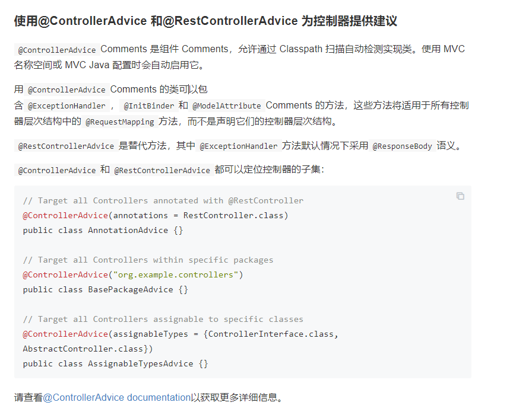

### @PropertySource注解

功能：

- 加载指定的属性文件（*.properties）到 Spring 的 Environment 中。可以配合 @Value 和@ConfigurationProperties 使用。
- @PropertySource 和 @Value组合使用，可以将自定义属性文件中的属性变量值注入到当前类的使用@Value注解的成员变量中。
- @PropertySource 和 @ConfigurationProperties组合使用，可以将属性文件与一个Java类绑定，将属性文件中的变量值注入到该Java类的成员变量中。

1、resource目录下定义配置文件 code-enum.properties：

```properties
# 测试@PropertySource注解

# map的第一种方式
pangchun.codeMap[0] = zero
pangchun.codeMap[1] = one
pangchun.codeMap[2] = two

# map的第二种方式
pangchun.codeMap.3 = three
pangchun.codeMap.4 = four
pangchun.codeMap.5 = five

# list的第一种方式： list不能同时使用两种方式，只会生效一种方式
pangchun.codeList = zero,one,two

# list的第二种方式
pangchun.codeList[3] = three
pangchun.codeList[4] = four
pangchun.codeList[5] = five

# @Value注解注入
pangchun.name = pangchun
```

2、定义一个config类用于获取配置信息：

```java
import org.springframework.beans.factory.annotation.Value;
import org.springframework.boot.context.properties.ConfigurationProperties;
import org.springframework.context.annotation.PropertySource;
import org.springframework.stereotype.Component;

import java.util.*;

@PropertySource("classpath:config/code-enum.properties")
@ConfigurationProperties(prefix = "pangchun")
@Component
public class CodeConfig {

    // 注意要有getter和setter方法，否则配置文件的值不能注入到变量中
    private Map<Integer, String> codeMap = new HashMap<>();
    private List<String> codeList = new ArrayList<>();

    // 使用@Value注解只能用配置的全名注入，类上配置的prefix对此注解不生效
    @Value("${pangchun.name}")
    private String name;

    public Map<Integer, String> getCodeMap() {
        return codeMap;
    }

    public void setCodeMap(Map<Integer, String> codeMap) {
        this.codeMap = codeMap;
    }

    public List<String> getCodeList() {
        return codeList;
    }

    public void setCodeList(List<String> codeList) {
        this.codeList = codeList;
    }

    public String getMapValue(int code) {
        String val = codeMap.get(code);
        return Optional.ofNullable(val).orElse(null);
    }

    public String getListValue(int index) {
        String val = codeList.get(index);
        return Optional.ofNullable(val).orElse(null);
    }
}
```

3、测试：

```java
@GetMapping("/test-property")
public String testProperty() {
    //return codeConfig.getMapValue(2);
    return codeConfig.getListValue(2);
}
```

## 重要类

### MultipartFile

#### 概述

此接口位于package org.springframework.web.multipart;包下，封装了一些比较好用的api，常用于spring框架的文件操作；多文件操作时使用MultipartFile数组，单文件直接使用MultipartFile即可；通过getSize方法可以限制文件大小；依赖包位于spring-web，是spring特有的类；

#### 接口方法

```java
public interface MultipartFile extends InputStreamSource {

	/**
	 * 获取表单中的文件参数名称，也就是controller中的参数名
	 */
	String getName();

	/**
	 * 返回客户端文件系统中的原始文件名（包含后缀名）
	 */
	@Nullable
	String getOriginalFilename();

	/**
	 * 获取的是文件的类型，注意是文件的类型，不是文件的拓展名
	 */
	@Nullable
	String getContentType();

	/**
	 * 判断传入的文件是否为空，如果为空则表示没有传入任何文件
	 */
	boolean isEmpty();

	/**
	 * 获取文件的大小，单位是字节。
	 */
	long getSize();

	/**
	 * 返回文件的字节数组表示
	 */
	byte[] getBytes() throws IOException;

	/**
	 * 返回文件的输入流表示
	 */
	@Override
	InputStream getInputStream() throws IOException;

	/**
	 * 返回此MultipartFile的资源表示形式
	 */
	default Resource getResource() {
		return new MultipartFileResource(this);
	}

	/**
	 * 将接收文件传输到给定目标文件
	 */
	void transferTo(File dest) throws IOException, IllegalStateException;

	/**
	 * 将接收文件传输到给定目标路径
	 * 注意default关键字
 	 */
	default void transferTo(Path dest) throws IOException, IllegalStateException {
        // 本质上使用的是FileCopyUtils的copy方法
		FileCopyUtils.copy(getInputStream(), Files.newOutputStream(dest));
	}
}
```


#### MultipartFile转File

1、方法一：创建临时文件

```java
private File MultipartFileToFile(MultipartFile multiFile) {
    // 获取文件名
    String originalFilename = multiFile.getOriginalFilename();
    // 获取文件前缀、后缀
    String prefix = originalFilename.substring(0, originalFilename.lastIndexOf("."));
    String suffix = originalFilename.substring(originalFilename.lastIndexOf("."));
    try {
      File file = File.createTempFile(prefix, suffix);
      multiFile.transferTo(file);
      return file;
    } catch (Exception e) {
      e.printStackTrace();
    }
    return null;
  }
```

缺点：生成的文件名不是我们原来的文件名。（防重名）

2、方法二：手动创建文件，用完删除

```java
public String MultipartFileToFile(List<MultipartFile> files) {
        List<File> fileList = new ArrayList<>();
    	String parentPath = System.currentTimeMillis() + RandomUtil.randomString(8);
        for (MultipartFile file : files) {
            String originalFilename = file.getOriginalFilename();
            String prefix = originalFilename.substring(0, originalFilename.lastIndexOf("."));
            String suffix = originalFilename.substring(originalFilename.lastIndexOf("."));
            try {
                File dest = new File(System.getProperty("user.dir") + "\\src\\main\\resources\\static\\temp\\" + parentPath, originalFilename);
                if(!dest.getParentFile().exists()) {
                    dest.getParentFile().mkdir();
                }
                file.transferTo(dest);
                System.out.println(tempFile.getName());
                fileList.add(dest);
            } catch (IOException e) {
                System.out.println("保存文件出错");
                e.printStackTrace();
            }
        }
    ... 业务代码 ...
        // 删除临时文件：此方法需要导入hutool工具包
        FileUtil.del(temp_dir_path + parentPath);
    
        return "OK";
    }
```

通过加一层parentPath目录防止文件重名问题；

### @ControllerAdvice

- 博客讲解参考：https://www.cnblogs.com/yanggb/p/10859907.html
- 官网文档讲解：https://www.docs4dev.com/docs/zh/spring-framework/4.3.21.RELEASE/reference/mvc.html#mvc-ann-controller-advice

作用范围：被@Controller注解的类；


### HttpMessageConverter< T >

- 博客参考：https://www.jianshu.com/p/3e1de3d02dd8
- 官网文档参考：https://www.docs4dev.com/docs/zh/spring-framework/4.3.21.RELEASE/reference/remoting.html#rest-message-conversion

Java Web 人员经常要设计 RESTful API（如何设计好的RESTful API），通过 json 数据进行交互。那么前端传入的 json 数据如何被解析成 Java 对象作为 API入参，API 返回结果又如何将 Java 对象解析成 json 格式数据返回给前端，其实在整个数据流转过程中，HttpMessageConverter 起到了重要作用；

```java
package org.springframework.http.converter;

import java.io.IOException;
import java.util.List;

import org.springframework.http.HttpInputMessage;
import org.springframework.http.HttpOutputMessage;
import org.springframework.http.MediaType;
import org.springframework.lang.Nullable;

/**
 * 用于在 HTTP 请求和响应之间进行转换的策略接口。
 *
 * @author Arjen Poutsma
 * @author Juergen Hoeller
 * @since 3.0
 * @param <T> the converted object type
 */
public interface HttpMessageConverter<T> {

	/**
	 * 指示此转换器是否可以读取给定的类。
	 * @param clazz 测试可读性的类
	 * @param mediaType 要读取的媒体类型（如果未指定，可以是 {@code null}）；通常是 {@code Content-Type} 标头的值。
	 * @return {@code true} 如果可读； {@code false} 否则
	 */
	boolean canRead(Class<?> clazz, @Nullable MediaType mediaType);

	/**
	 * 指示此转换器是否可以写入给定的类。
	 * @param clazz 测试可写性的类
	 * @param mediaType 要写入的媒体类型（如果未指定，可以是 {@code null}）；通常是 {@code Accept} 标头的值。
	 * @return {@code true} 如果可写； {@code false} 否则
	 */
	boolean canWrite(Class<?> clazz, @Nullable MediaType mediaType);

	/**
	 * 返回此转换器支持的 {@link MediaType} 对象列表。
	 * @return 支持的媒体类型列表，可能是不可变的副本
	 */
	List<MediaType> getSupportedMediaTypes();

	/**
	 * 从给定的输入消息中读取给定类型的对象，并返回它。
	 * @param clazz 要返回的对象类型。此类型必须先前已传递给此接口的 {@link #canRead canRead} 方法，该方法必须已返回 {@code true}。
	 * @param inputMessage 要从中读取的 HTTP 输入消息
	 * @return 转换后的对象
	 * @throws IOException in case of I/O errors
	 * @throws HttpMessageNotReadableException in case of conversion errors
	 */
	T read(Class<? extends T> clazz, HttpInputMessage inputMessage)
			throws IOException, HttpMessageNotReadableException;

	/**
	 * 将给定的对象写入给定的输出消息。
	 * @param t 要写入输出消息的对象。此对象的类型必须先前已传递给此接口的 {@link #canWrite canWrite} 方法，该方法必须已返回 {@code true}。
	 * @param contentType 写作时使用的内容类型。可能是 {@code null} 以指示必须使用转换器的默认内容类型。如果不是 {@code null}，则此媒体类型必须先前已传递给此接口的 {@link #canWrite canWrite} 方法，该方法必须已返回 {@code true}。
	 * @param outputMessage 要写入的消息
	 * @throws IOException in case of I/O errors
	 * @throws HttpMessageNotWritableException in case of conversion errors
	 */
	void write(T t, @Nullable MediaType contentType, HttpOutputMessage outputMessage)
			throws IOException, HttpMessageNotWritableException;

}
```

### ResponseBodyAdvice

ResponseBodyAdvice是SpringMVC4.1提供的一个接口，它允许在 执行 @ResponseBody后自定义返回数据，或者将返回ResponseEntity的 Controller Method在写入主体前使用 HttpMessageConverter进行自定义操作。由此可见，它的作用范围为：

- 使用@ResponseBody注解进行标记的控制器方法；（通常我们使用的都是这个，已经亲自验证过）
- 返回@ResponseEntity的控制器方法；（很少使用，了解即可，就不去验证了）

```java
/**
 * 允许在执行 {@code @ResponseBody} 或 {@code ResponseEntity} 控制器方法之后但在使用 {@code HttpMessageConverter} 编写正文之前自定义响应。
 *
 * 可以直接使用 {@code RequestMappingHandlerAdapter} 和 {@code ExceptionHandlerExceptionResolver} 注册实现，或者更有可能使用 {@code  
 * @ControllerAdvice} 进行注释，在这种情况下，它们将被两者自动检测。
 */
public interface ResponseBodyAdvice<T> {

   /**
    * 此组件是否支持给定的控制器方法返回类型和选定的 {@code HttpMessageConverter} 类型。
    * @param returnType 返回类型
    * @param converterType 选择的转换器类型
    * @return 如果返回true beforeBodyWrite方法会被调用，否则不调用
    */
   boolean supports(MethodParameter returnType, Class<? extends HttpMessageConverter<?>> converterType);

   /**
    * 在选择 {@code HttpMessageConverter} 之后和调用其 write 方法之前调用。
    * @param body 要写入的正文
    * @param returnType 控制器方法的返回类型
    * @param selectedContentType 通过内容协商选择的内容类型(content type)
    * @param selectedConverterType 选择写入响应的转换器类型
    * @param request 当前请求
    * @param response 当前响应
    * @return 传入的主体或修改过的（可能是新的）实例
    */
   @Nullable
   T beforeBodyWrite(@Nullable T body, MethodParameter returnType, MediaType selectedContentType,
         Class<? extends HttpMessageConverter<?>> selectedConverterType,
         ServerHttpRequest request, ServerHttpResponse response);

}
```

### RequestBodyAdvice

此接口用于接收请求数据时做一些增强处理，比如解密；

需要使用再作深入了解；

- 博客参考：https://zhuanlan.zhihu.com/p/347675665
- 统一加密解密：https://cloud.tencent.com/developer/article/1839569
- 参考解析：https://cloud.tencent.com/developer/article/1334235
- 参考解析：https://cloud.tencent.com/developer/article/1369656

## 三方工具

### FIleUtils

#### 依赖

```xml
<!-- commons-io -->
<dependency>
    <groupId>org.apache.commons</groupId>
    <artifactId>commons-io</artifactId>
    <version>1.3.2</version>
</dependency>
```

#### 下载网络文件

```java
@Test
void contextLoads3() throws IOException {
    URL url = new URL("https://img2020.cnblogs.com/blog/2352436/202107/2352436-20210702233210176-2099248119.png");
    File file = new File("C:\\Users\\Administrator\\Desktop\\文档\\1.png");
    FileUtils.copyURLToFile(url, file);
}
```

#### 通过URL获取本地文件

```java
@Test
void contextLoads3() throws IOException {
    // 获取网络文件
    URL url = new URL("file://https://img2020.cnblogs.com/blog/2352436/202107/2352436-20210702233210176-2099248119.png");
    
    // 获取本地文件
    URL url = new URL("file://C:/Users/Administrator/Desktop/文档/1.png");
    
    File file = FileUtils.toFile(url);
    
    // 此抽象路径名表示的文件的长度（以字节为单位），如果文件不存在，则为 0L。
    System.out.println(file.length());
}
// 输出
获取网络文件时输出 0
获取本地文件时输出 91564
```

注意：

- URL的协议必须为file；
- 只能获取本地文件，网络文件获取不到；

### HuTools工具包

文档：https://hutool.cn/docs/#/

#### 依赖

```xml
<!-- hutools -->
<dependency>
    <groupId>cn.hutool</groupId>
    <artifactId>hutool-all</artifactId>
    <version>5.7.5</version>
</dependency>
```

#### 通过网络资源url字符串获取输入流

```java
 InputStream inputStream = HttpUtil.createGet("https://img2020.cnblogs.com/blog/2352436/202107/2352436-20210702233210176-2099248119.png").execute().bodyStream();
```

#### 将日期字符串转为标准yyyy-MM-dd HH:mm:ss格式

```java
    /**
     * 将其它格式的时间字符串转换为标准yyyy-MM-dd HH:mm:ss格式字符串
     * 
     * @param str 以下格式的时间字符串
     * yyyy-MM-dd HH:mm:ss
     * yyyy/MM/dd HH:mm:ss
     * yyyy.MM.dd HH:mm:ss
     * yyyy年MM月dd日 HH时mm分ss秒
     * yyyy-MM-dd
     * yyyy/MM/dd
     * yyyy.MM.dd
     * HH:mm:ss
     * HH时mm分ss秒
     * yyyy-MM-dd HH:mm
     * yyyy-MM-dd HH:mm:ss.SSS
     * yyyyMMddHHmmss
     * yyyyMMddHHmmssSSS
     * yyyyMMdd
     * EEE, dd MMM yyyy HH:mm:ss z
     * EEE MMM dd HH:mm:ss zzz yyyy
     * yyyy-MM-dd'T'HH:mm:ss'Z'
     * yyyy-MM-dd'T'HH:mm:ss.SSS'Z'
     * yyyy-MM-dd'T'HH:mm:ssZ
     * yyyy-MM-dd'T'HH:mm:ss.SSSZ
     *            
     * @return 标准yyyy-MM-dd HH:mm:ss格式时间字符串
     */
    public static String parse(String str) {
        DateTime dateTime = new DateTime(str); // 需要5.6.2以后的依赖，否则使用DateUtil.parse(str)
        return dateTime.toString();
    }
```

### MapStruct

文档：https://mapstruct.org/documentation/stable/reference/html/#mappers-factory

匹配规则：默认属性名与类型**都相同**的字段会被匹配；二者缺一会赋值为null；

无参构造：实体类必须包含无参构造；

#### 依赖

```xml
<properties>
    <java.version>1.8</java.version>
    <mapstruct.version>1.2.0.Final</mapstruct.version>
</properties>
<dependencies>
    <!--mapstruct-->
    <dependency>
        <groupId>org.mapstruct</groupId>
        <artifactId>mapstruct-jdk8</artifactId>
        <version>${mapstruct.version}</version>
    </dependency>

    <dependency>
        <groupId>org.mapstruct</groupId>
        <artifactId>mapstruct-processor</artifactId>
        <version>${mapstruct.version}</version>
    </dependency>

    <dependency>
        <groupId>org.mapstruct</groupId>
        <artifactId>mapstruct</artifactId>
        <version>${mapstruct.version}</version>
    </dependency>
</dependencies>
```

#### 基本使用

1、定义实体：

```java
@Data
@AllArgsConstructor
@NoArgsConstructor
public class Phone {
    private String name;
    private String color;
    private String size;
    private int price;
}

// 注意：这两个实体的价格属性名称不同；

@Data
@AllArgsConstructor
@NoArgsConstructor
public class PhoneVO {
    private String name;
    private String color;
    private String size;
    private int voPrice;
}
```

2、定义转换器：

```java
@Mapper
public interface PhoneConverter {

    PhoneConverter PHONE_CONVERTER = Mappers.getMapper(PhoneConverter.class);
    
    // Phone转VO
    @Mappings({
        // 要映射的属性名称不同时需要如下单独列出
        @Mapping(source = "price", target = "voPrice")
	})
    PhoneVO toPhoneVO(Phone phone);

    // VO转Phone
    @Mappings({
        @Mapping(source = "voPrice", target = "price")
	})
    Phone toPhone(PhoneVO vo);
}
```

3、测试：

```java
@Test
void contextLoads() {
    Phone phone = new Phone("iPhone12", "red", "5.0", 8999);
    PhoneVO vo = PhoneConverter.PHONE_CONVERTER.toPhoneVO(phone);
    System.out.println(vo);
}

// 输出
PhoneVO(name=iPhone12, color=red, size=5.0, voPrice=8999)
```

#### 字符串与日期

1、定义实体：

```java
@Data
@AllArgsConstructor
@NoArgsConstructor
public class Phone {
    private String name;
    private String color;
    private String size;
    private int price;
    private LocalDateTime produceTime;
    /** 是否在保 false - 否， true - 是 */
    private Boolean inGuarantee;
}

@Data
@AllArgsConstructor
@NoArgsConstructor
public class PhoneVO {
    private String name;
    private String color;
    private String size;
    private int price;
    private String produceTime;
    /** 是否在保，只填 在保 或 不在保 */
    private String inGuarantee;
}
```

2、定义转换器：

```java
// 使用dateFormat定义字符串格式即可

@Mappings({
        @Mapping(source = "produceTime", dateFormat = "dd-MM-yyyy HH:mm:ss",target = "produceTime")
})
PhoneVO toPhoneVO(Phone phone);
```

3、测试：

```java
@Test
void contextLoads() {
    Phone phone = new Phone("iPhone12", "red", "5.0", 8999, LocalDateTime.now(), true);
    PhoneVO vo = PhoneConverter.PHONE_CONVERTER.toPhoneVO(phone);
    System.out.println(vo);
}

// 输出
PhoneVO(name=iPhone12, color=red, size=5.0, price=8999, produceTime=21-07-2021 09:30:35, inGuarantee=true)
```

#### 字符串与布尔

1、定义实体：

同上实体；

2、定义转换器：

```java
// 使用expression，用java代码来设置判断条件

@Mappings({
        @Mapping(source = "produceTime", dateFormat = "dd-MM-yyyy HH:mm:ss" , target = "produceTime"),
        @Mapping(target = "inGuarantee", expression = "java(vo.getInGuarantee().equals(\"在保\"))")
})
Phone toPhone(PhoneVO vo);
```

注意：

- 使用expression = "java(...)"表达式，括号中为java代码；
- expression和source只能包含任意一个，不能同时使用；

3、测试：

```java
@Test
void contextLoads2() {
    PhoneVO vo = new PhoneVO("iPhone12", "red", "5.0", 8999, "16-07-2021 15:56:41", "不在保");
    Phone phone = PhoneConverter.PHONE_CONVERTER.toPhone(vo);
    System.out.println(phone);
}

// 输出
Phone(name=iPhone12, color=red, size=5.0, price=8999, produceTime=2021-07-16T15:56:41, inGuarantee=false)
```

#### 使用java代码调用静态方法

1、静态方法如下：

```java
public enum SmsEnum {
    ....

    public static String getTypeByCode(int code) {
        ....
    }
}
```

2、测试：

```java
@Mapper
public interface SmsTemplateConverter {

    SmsTemplateConverter SMS_TEMPLATE_CONVERTER = Mappers.getMapper(SmsTemplateConverter.class);

    @Mappings({
            // 这里只能通过全类名来调用静态方法，否则类无法注入到编译后的文件
            @Mapping(target = "templateType", expression = "java(org.example.enums.SmsEnum.getTypeByCode(platformTemp.getTemplateType()))")
    })
    SmsCompanyTemplateVO toSmsCompanyTemplateVO(SmsCompanyTemplate companyTemp, SmsPlatformTemplate platformTemp);
}
```

#### 常见问题

==1、java: Internal error in the mapping processor: java.lang.NullPointerException：==

此问题与idea版本有关，我是用idea2020.3出现此问题；解决如下：

Setting -->Build,Execution,Deployment -->Compiler -->User-local build加上参数：-Djps.track.ap.dependencies=false

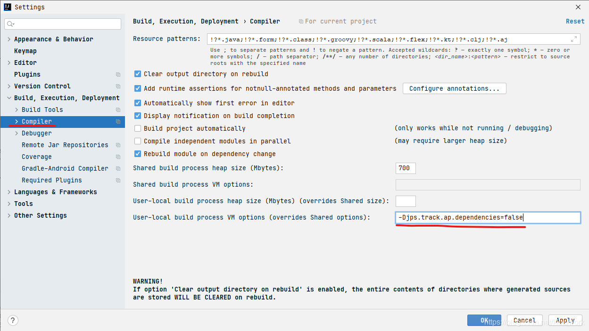

==2、jar包与lombok版本冲突：==

编译出错时也可能时jar包版本高低的问题，尝试换低版本或者高版本即可；这里给出一个不冲突的版本示例：

```xml
<properties>
    <mapstruct.version>1.2.0.Final</mapstruct.version>
</properties>

<!--mapstruct-->
<dependency>
    <groupId>org.mapstruct</groupId>
    <artifactId>mapstruct-jdk8</artifactId>
    <version>${mapstruct.version}</version>
</dependency>
<dependency>
    <groupId>org.mapstruct</groupId>
    <artifactId>mapstruct-processor</artifactId>
    <version>${mapstruct.version}</version>
</dependency>
<dependency>
    <groupId>org.mapstruct</groupId>
    <artifactId>mapstruct</artifactId>
    <version>${mapstruct.version}</version>
</dependency>

<!--lombok-->
<dependency>
    <groupId>org.projectlombok</groupId>
    <artifactId>lombok</artifactId>
    <version>1.16.18</version>
</dependency>
```

### EasyExcel

#### 读取的数据全为null

- 造成这个原因是项目使用了lombok并且还加了@Accessors(chain = true)链式注解，因为easyExcel和这个要冲突，所以把这个删掉就行，
- 或者手动添加setter和getter方法。

## 格式规范

### PO、VO、DTO

#### 概念

[一遍文章搞清楚VO、DTO、DO、PO的概念、区别-阿里云开发者社区 (aliyun.com)](https://developer.aliyun.com/article/715619)

https://blog.csdn.net/qq_35246620/article/details/77247427

#### VO入参

controller接收参数的对象是vo还是dto：

应该传的是vo 但是根据情况而定，尤其是前后分离，有特定的前端开发人员的时候。因为dto往往会添加很多额外的数据信息，打个比方，用户新增，往往前端传递的是账户名、密码、创建人标示等等很少的信息，但是dto作为一个中转数据，会添加例如更新人、用户状态等等其他的信息，如果前端传递的是dto，如此多的额外信息会给前端造成很多问题。如果是小项目的话，前后端都是一个人在进行，那就无所谓了，后端需要哪些，不需要哪些心里有数，传递dto就无所谓了。 一般的数据转换是，前端传递vo给接口，接口将vo转为dto传递给service，service将dto分解为do，调用领域服务进行调度，然后逆向转为vo或者其他的返回结果，传递给前台。

#### VO序列化

不需要实现序列化接口：

因为前后端分离数据交互使用的是json数据，而我们一般使用@ResponstBody注解会自动解析为json格式发送，而json本质仍然是字符串，字符串本身已经是实现了序列化接口。

```java
public final class String
    implements java.io.Serializable, Comparable<String>, CharSequence {
```

# Java

## 集合

### 集合与null

1、关于list、set、map的值是否可以为null：

```java
import com.alibaba.fastjson.JSON;

import java.util.*;

public class test {

    public static void main(String[] args) {
        List<String> list = new ArrayList<>();
        Set<String> set = new HashSet<>();
        Map<String, String> map = new HashMap<>();

        list.add(null);
        list.add(null);
        set.add(null);
        set.add(null);
        map.put(null, null);
        map.put(null, "123");

        System.out.println("=============list==============");
        System.out.println(JSON.toJSONString(list));
        System.out.println("=============set==============");
        System.out.println(JSON.toJSONString(set));
        System.out.println("=============map==============");
        System.out.println(JSON.toJSONString(map));
        map.put(null, null);
        System.out.println(JSON.toJSONString(map));
    }
}
```

```java
// 输出
=============list==============
[null,null]
=============set==============
[null]
=============map==============
{null:"123"}
{}
```

### HashMap初始容量设置

HashMap有扩容机制，就是当达到扩容条件时会进行扩容。HashMap的扩容条件就是当HashMap中的元素个数（size）超过临界值（threshold）时就会自动扩容。在HashMap中，threshold = loadFactor * capacity。

如果我们没有设置初始容量大小，随着元素的不断增加，HashMap会发生多次扩容，而HashMap中的扩容机制决定了每次扩容都需要重建hash表，是非常影响性能的。

《阿里巴巴开发手册》也建议集合初始化时，指定集合初始值大小。

那么初始值设置多大合适？

>有些人会自然想到，我准备塞多少个元素我就设置成多少呗。比如我准备塞7个元素，那就new HashMap(7)。
>
>**但是，这么做不仅不对，而且以上方式创建出来的Map的容量也不是7。**
>
>因为，当我们使用HashMap(int initialCapacity)来初始化容量的时候，HashMap并不会使用我们传进来的initialCapacity直接作为初始容量。

**JDK会默认帮我们计算一个相对合理的值当做初始容量。所谓合理值，其实是找到第一个比用户传入的值大的2的幂。**

> 也就是说，当我们new HashMap(7)创建HashMap的时候，JDK会通过计算，帮我们创建一个容量为8的Map；当我们new HashMap(9)创建HashMap的时候，JDK会通过计算，帮我们创建一个容量为16的Map。
>
> **但是，这个值看似合理，实际上并不尽然。因为HashMap在根据用户传入的capacity计算得到的默认容量，并没有考虑到loadFactor这个因素，只是简单机械的计算出第一个大约这个数字的2的幂。**
>
> loadFactor是负载因子，当HashMap中的元素个数（size）超过 threshold = loadFactor * capacity时，就会进行扩容。
>
> 也就是说，如果我们设置的默认值是7，经过JDK处理之后，HashMap的容量会被设置成8，但是，这个HashMap在元素个数达到 8*0.75 = 6的时候就会进行一次扩容，这明显是我们不希望见到的。

那么，到底设置成什么值比较合理呢？

>这里我们可以参考JDK8中putAll方法中的实现的，这个实现在guava（21.0版本）也被采用。
>
>这个值的计算方法就是：`return (int) ((float) expectedSize / 0.75F + 1.0F);`
>
>比如我们计划向HashMap中放入7个元素的时候，我们通过expectedSize / 0.75F + 1.0F计算，7/0.75 + 1 = 10 ,10经过JDK处理之后，会被设置成16，这就大大的减少了扩容的几率。
>
>当HashMap内部维护的哈希表的容量达到75%时（默认情况下），会触发rehash，而rehash的过程是比较耗费时间的。所以初始化容量要设置成expectedSize/0.75 + 1的话，可以有效的减少冲突也可以减小误差。（大家结合这个公式，好好理解下这句话）
>
>**所以，我们可以认为，当我们明确知道HashMap中元素的个数的时候，把默认容量设置成expectedSize / 0.75F + 1.0F 是一个在性能上相对好的选择，但是，同时也会牺牲些内存。**
>
>这个算法在guava中有实现，开发的时候，可以直接通过Maps类创建一个HashMap：`Map<String, String> map = Maps.newHashMapWithExpectedSize(7);`。
>
>其代码实现如下：(要导入谷歌提供的guava包）
>
> ```java
> /** 创建一个指定容量的map，expectedSize就是预期放入的元素数量，当超出expectedSize，仍然会自动扩容 */
> public static <K, V> HashMap<K, V> newHashMapWithExpectedSize(int expectedSize) {
>     return new HashMap<>(capacity(expectedSize));
>   }
>
> /** 返回足以防止地图被调整大小的容量，只要它的增长不大于 expectedSize 并且负载因子≥其默认值 (0.75)。其实就是说，返回一个最合适的、刚好能装我们预期大小容量的最小值。 */
> static int capacity(int expectedSize) {
>     if (expectedSize < 3) {
>       checkNonnegative(expectedSize, "expectedSize");
>       return expectedSize + 1;
>     }
>     if (expectedSize < Ints.MAX_POWER_OF_TWO) {
>       return (int) ((float) expectedSize / 0.75F + 1.0F);
>     }
>     return Integer.MAX_VALUE; 
>   }
> ```
>
>但是，以上的操作是一种用内存换性能的做法，真正使用的时候，要考虑到内存的影响。但是，大多数情况下，我们还是认为内存是一种比较富裕的资源。
>
>如果不能确定可能要存的条目数量，就设置为默认16即可。
>
>但是话又说回来了，有些时候，我们到底要不要设置HashMap的初识值，这个值又设置成多少，真的有那么大影响吗？其实也不见得！
>
>可是，大的性能优化，不就是一个一个的优化细节堆叠出来的吗？
>
>再不济，以后你写代码的时候，使用Maps.newHashMapWithExpectedSize(7);的写法，也可以让同事和老板眼前一亮。

## Stream流

### map

1、获取List中实体的某个字段的集合：

```java
List<Long> templateIdList = templateList.stream().map(SmsCompanyTemplate::getTemplateId).distinct().collect(Collectors.toList());
```

### filter

1、筛选元素：

```java
SmsPlatformTemplate platTemp = platTempList.stream().filter(e -> e.getId().equals(comTemp.getTemplateId())).distinct().collect(Collectors.toList()).get(0);
```

### anyMatch

1、查询list中元素是否存在某一属性值重复：

```java
for (People e1 : list) {
    // 当检索到符合匹配规则的元素时就会自动退出流，后面的元素不会继续检索
    boolean anyMatch = list.stream().anyMatch(e2 -> {
        return e1 != e2 && e2.getName().equals(e1.getName());
    });
    System.out.println(anyMatch);
    if (anyMatch) {
        System.out.println("不能有重名");
        break;
    }
}
```

### toMap

1、集合转map：

```java
Map<Long, String> map = list.stream.collect(Collectors.toMap(Person::getId, Person::getName));
```

## 枚举类

### 定义与使用

```java
/**
 * 短信服务有关的枚举
 *
 * @author zhangqianchun
 * @since 2021-8-16
 */
public enum SmsEnum {

    /** 短信类型 0：验证码。1：短信通知。2：推广短信。3：国际/港澳台消息。 */
    verification(0, "验证码"),
    notification(1, "短信通知"),
    promotion(2, "推广短信"),
    internation(3, "国际/港澳台消息");

    /** 短信类型代号 */
    private final int code;

    /** 短信类型 */
    private final String type;

    SmsEnum(int code, String type) {
        this.code = code;
        this.type = type;
    }

    public int getCode() {
        return code;
    }

    public String getType() {
        return type;
    }

    /**
     * 通过code获取type
     * @param code 短信类型代号
     * @return     短信类型
     */
    public String getTypeByCode(int code) {
        SmsEnum[] enums = SmsEnum.values();
        List<SmsEnum> list = Arrays.stream(enums).filter(e -> e.code == code).distinct().collect(Collectors.toList());
        return list.isEmpty() ? null : list.get(0).type;
    }
}
```

### 根据实例属性获取实例

1、方式一：switch遍历

```java
/**
 * 性别枚举
 *
 * @author pangchun
 * @since 2021/9/2
 */
public enum GenderEnum {

    /**
     * 男
     */
    MAN("男"),
    /**
     * 女
     */
    WOMAN("女");

    /**
     * 属性
     */
    private final String attribute;

    /**
     * 构造
     * @param attribute 属性
     */
    GenderEnum(String attribute) {
        this.attribute = attribute;
    }

    /**
     * getter
     * @return 属性
     */
    public String getAttribute() {
        return attribute;
    }

    /**
     * 通过属性获取枚举实例
     * @param attribute 属性
     * @return          实例
     */
    public static GenderEnum getByAttribute(String attribute) {
        // 防止空指针
        if (attribute == null) {
            return null;
        }
        switch (attribute) {
            case "男": return MAN;
            case "女": return WOMAN;
            default: throw new IllegalArgumentException(attribute + "没有对应的枚举实例！");
        }
    }
}
```

2、方式二：静态map（推荐）

```java
/**
 * 性别枚举
 *
 * @author pangchun
 * @since 2021/9/2
 */
public enum GenderEnum {

    /**
     * 男
     */
    MAN("男"),
    /**
     * 女
     */
    WOMAN("女");

    /**
     * 属性
     */
    private final String attribute;


    private static final Map<String, GenderEnum> ENUM_MAP = new HashMap<>();

    static {
        for (GenderEnum item : GenderEnum.values()) {
            ENUM_MAP.put(item.attribute, item);
        }
    }

    /**
     * 通过属性获取枚举实例
     * @param attribute 属性
     * @return          实例
     */
    public static GenderEnum getByAttribute(String attribute) {
        // 如果传入null，获取到的也是null
        return ENUM_MAP.get(attribute);
    }

    /**
     * 构造
     * @param attribute 属性
     */
    GenderEnum(String attribute) {
        this.attribute = attribute;
    }

    /**
     * getter
     * @return 属性
     */
    public String getAttribute() {
        return attribute;
    }
}
```

3、方式三：stream流（推荐）

```java
import java.util.Arrays;
import java.util.NoSuchElementException;

/**
 * 性别枚举
 *
 * @author pangchun
 * @since 2021/9/2
 */
public enum GenderEnum {

    /**
     * 男
     */
    MAN("男"),
    /**
     * 女
     */
    WOMAN("女");

    /**
     * 属性
     */
    private final String attribute;

    /**
     * 构造
     * @param attribute 属性
     */
    GenderEnum(String attribute) {
        this.attribute = attribute;
    }

    /**
     * getter
     * @return 属性
     */
    public String getAttribute() {
        return attribute;
    }

    /**
     * 通过属性获取枚举实例
     * @param attribute 属性
     * @return          实例
     */
    public static GenderEnum getByAttribute(String attribute) {
        return Arrays.stream(GenderEnum.values()).filter(e -> e.attribute.equals(attribute)).findAny().orElseThrow(() -> {
            return new NoSuchElementException("No value present");
        });
    }
}
```

## 正则

正则api请参考jdk文档：https://www.matools.com/api/java8

常用正则：https://c.runoob.com/front-end/854

1、定义正则常量池：

```java
/**
 * 正则字符串常量池
 *
 * @author pangchun
 * @since 2021/8/29
 */
public class RegexConstant {

    /** 校验数字的表达式 */
    // 数字
    public static final String NUMBER = "^[0-9]*$";

    /** 校验字符的表达式 */
    // 汉字
    public static final String CHINESE_CHARACTER = "^[\u4e00-\u9fa5]{0,}$";

    /** 特殊需求表达式 */
    // 邮箱
    public static final String EMAIL = "^\\w+([-+.]\\w+)*@\\w+([-.]\\w+)*\\.\\w+([-.]\\w+)*$";
    // 逗号或分号
    public static final String COMMA_OR_SEMICOLON = ",|;";
    // 大括号及其内容
    public static final String CURLY_BRACES = "\\{([^}]*)\\}";
    // 中括号及其内容
    public static final String BRACKET = "\\[([^}]*)\\]";
    // 小括号及其内容
    public static final String PARENTHESES = "\\(([^}]*)\\)";
    // 日期格式
    public static final String DATE = "^\\d{4}-\\d{1,2}-\\d{1,2}";
    // 日期格式与范围
    public static final String DATE_AND_SCOPE = "^((\\d{2}(([02468][048])|([13579][26]))[\\-\\/\\s]?((((0?[13578])|(1[02]))[\\-\\/\\s]?((0?[1-9])|([1-2][0-9])|(3[01])))|(((0?[469])|(11))[\\-\\/\\s]?((0?[1-9])|([1-2][0-9])|(30)))|(0?2[\\-\\/\\s]?((0?[1-9])|([1-2][0-9])))))|(\\d{2}(([02468][1235679])|([13579][01345789]))[\\-\\/\\s]?((((0?[13578])|(1[02]))[\\-\\/\\s]?((0?[1-9])|([1-2][0-9])|(3[01])))|(((0?[469])|(11))[\\-\\/\\s]?((0?[1-9])|([1-2][0-9])|(30)))|(0?2[\\-\\/\\s]?((0?[1-9])|(1[0-9])|(2[0-8]))))))";
}
```

定义正则常量池，存储所有正则表达式，形成良好代码规范，避免魔法值；

2、定义正则模板常量池：

```java
import java.util.regex.Pattern;

/**
 * 正则模板常量池
 *
 * @author pangchun
 * @since 2021/8/29
 */
public class PatternConstant {

    // Email
    public static final Pattern EMAIL = Pattern.compile(RegexConstant.EMAIL);
    // 汉字
    public static final Pattern CHINESE_CHARACTER = Pattern.compile(RegexConstant.CHINESE_CHARACTER);
    // 大括号及其内容
    public static final Pattern CURLY_BRACES = Pattern.compile(RegexConstant.CURLY_BRACES);
    // 中括号及其内容
    public static final Pattern BRACKET = Pattern.compile(RegexConstant.BRACKET);
    // 小括号及其内容
    public static final Pattern PARENTHESES = Pattern.compile(RegexConstant.PARENTHESES);
    // 日期格式
    public static final Pattern DATE = Pattern.compile(RegexConstant.DATE);
    // 日期格式与范围
    public static final Pattern DATE_AND_SCOPE = Pattern.compile(RegexConstant.DATE_AND_SCOPE);
}
```

因为Pattern.compile(String regx)的compile过程比较消耗资源，因此使用常量池，在项目启动就把需要用到的正则编译好，以后直接通过类引用正则常量即可；

3、定义正则工具类：

```java
import java.util.ArrayList;
import java.util.Arrays;
import java.util.List;
import java.util.regex.Matcher;
import java.util.regex.Pattern;

/**
 * 正则工具
 *
 * @author pangchun
 * @since 2021/8/29
 */
public class RegxUtil {

    /**
     * 校验字符串是否匹配指定正则表达式
     * @param pattern 正则模板，从PatternConstant类获取
     * @param param   字符串参数
     * @return        true/false
     */
    public static Boolean stringCheck(Pattern pattern, String param) {
        Matcher matcher = pattern.matcher(param);
        return matcher.matches();
    }

    /**
     * 分割字符串以指定正则表达式
     * @param regex  正则表达式，从RegxConstant类获取
     * @param param 字符串参数
     * @return      分割的字符串数组
     */
    public static List<String> stringSplit(String regex, String param) {
        List<String> list = new ArrayList<>();
        String[] array = param.split(regex);
        if (array.length > 0) {
            list = new ArrayList<>(Arrays.asList(array));
        }
        return list;
    }

    /**
     * 提取字符串位于两个符号之间的内容，如小括号、中括号、大括号等
     * @param pattern 正则模板，从PatternConstant类获取
     * @param param   字符串参数
     * @return        提取的字符串集合
     */
    public static List<String> stringExtract(Pattern pattern, String param) {
        List<String> list = new ArrayList<>();
        Matcher matcher = pattern.matcher(param);
        // matcher.find()：剩余序列中是否还存在匹配项
        while (matcher.find()) {
            // matcher.group()：获取此次匹配到的第一个匹配项
            String firstStr = matcher.group();
            String s = firstStr.substring(1, firstStr.length() - 1);
            if (!s.isEmpty()) {
                list.add(s);
            }
        }
        return list;
    }
}
```

# Bug


## 【bug】No converter found...

在后端接口要为前端响应数据时，如果响应的数据时自定义的实体类，那么要为这个实体类添加getter和setter方法，否则会报如下错误：

```java
2021-09-13 15:11:47.420  WARN 6736 --- [nio-9000-exec-2] .w.s.m.s.DefaultHandlerExceptionResolver : Resolved [org.springframework.http.converter.HttpMessageNotWritableException: No converter found for return value of type: class org.example.common_respsonse.Person]
```

## 【bug】通用响应时返回类型为String时会报强转错误

**错误说明**

接口如下：

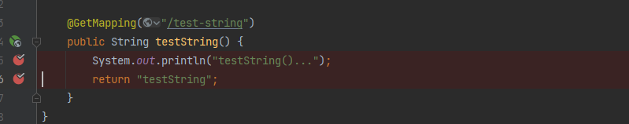

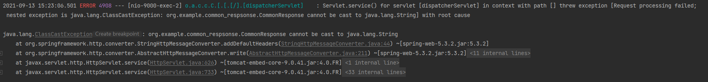

原因是当返回值为String时，Spring会使用StringHttpMessageConverter来处理返回体，但是我们定义的统一返回处理类将返回值String变成了我们自己定义的统一返回类，里面的data-T为String，这是一个对象。导致类型强转失败了。具体的代码如下：

1、父类AbstractHttpMessageConverter先调用write方法，再调用到addDefaultHeaders方法如下： 可以发现此时有一个泛型T一直在传递

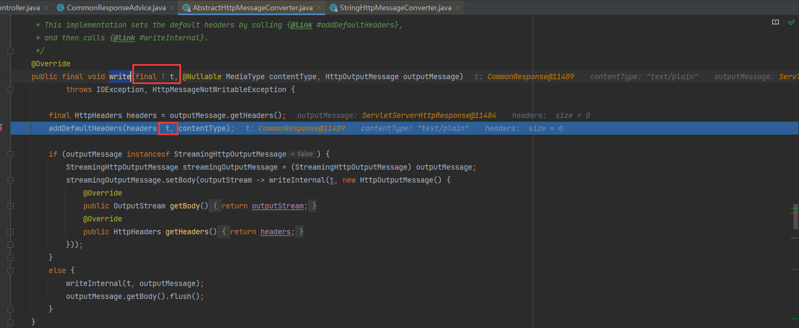

2、到了addDefaultHeaders方法时，可以看到这里会调子类StringHttpMessageConverter重写的addDefaultHeaders方法： 

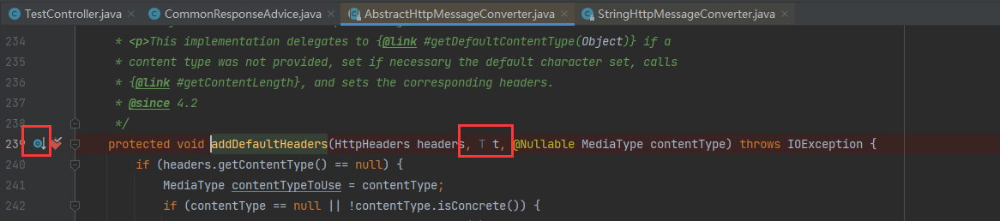

3、到达子类StringHttpMessageConverter重写的addDefaultHeaders方法处可以明显发现，原本传递的泛型T的位置为String，那么肯定会强转：

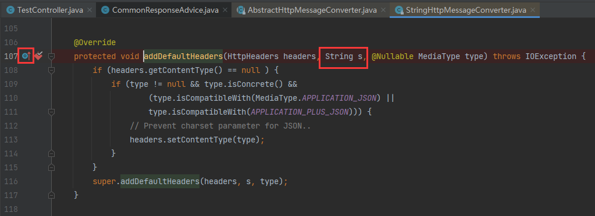

4、而由于我们在之前统一响应处理时已经将返回值String封装为一个CommonResponse对象，因此会强转出错：

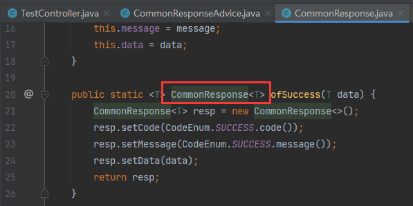

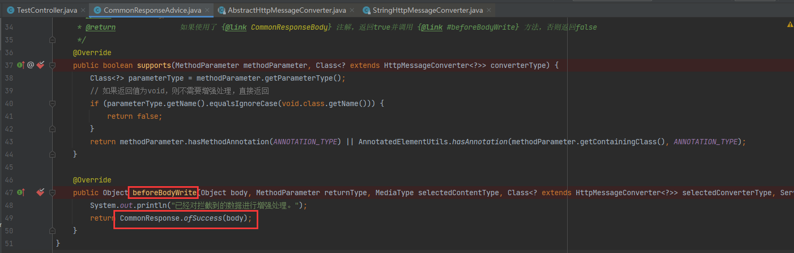

**解决方式**

解决这个问题的关键是避免使用StringHttpMessageConverter来处理返回体，推荐两种常用的解决方式：

1、使用MappingJackson2HttpMessageConverter：（不推荐）

```java
import com.alibaba.fastjson.support.spring.FastJsonHttpMessageConverter;
import org.springframework.boot.autoconfigure.http.HttpMessageConverters;
import org.springframework.context.annotation.Bean;
import org.springframework.context.annotation.Configuration;

@Configuration
public class CommonResponseConfig {

    @Bean
    public HttpMessageConverters httpMessageConverters() {
        return new HttpMessageConverters(new FastJsonHttpMessageConverter());
    }
}
```

但是这种方式会有问题：当前端传来xml类型的参数时，FastJsonHttpMessageConverter不能处理导致报错；因此我们需要能同时处理xml、json以及string的converter；

```java
@PostMapping(value = "/test-xml", consumes = MediaType.APPLICATION_XML_VALUE)
public String testXml(@RequestBody String xml) {
    System.out.println("testXml()...");
    return "testXml";
}
```

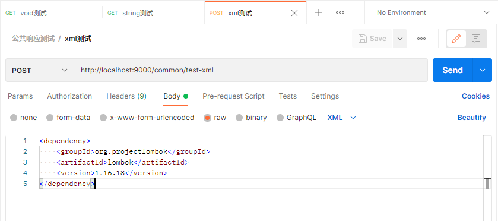

2、使用MappingJackson2HttpMessageConverter：

```java
import org.springframework.context.annotation.Configuration;
import org.springframework.http.converter.HttpMessageConverter;
import org.springframework.http.converter.json.MappingJackson2HttpMessageConverter;
import org.springframework.web.servlet.config.annotation.WebMvcConfigurer;

import java.util.List;

/**
 * web-mvc配置
 *
 * @author pangchun
 * @since 2021/9/13
 */
@Configuration
public class WebMvcConfig implements WebMvcConfigurer {

    /**
     * 配置消息转换器
     * @param converters
     */
    @Override
    public void extendMessageConverters(List<HttpMessageConverter<?>> converters) {
        converters.add(0,new MappingJackson2HttpMessageConverter());

    }
}
```

同上，也可配置以下的converter来处理xml与json的问题：

- MappingJacksonHttpMessageConverter
- MarshallingHttpMessageConverter
- Jaxb2RootElementHttpMessageConverter

## 【bug】数据表名不能为order

表名为order时crud都会报错：

```error
threw exception [Request processing failed; nested exception is org.springframework.jdbc.BadSqlGrammarException: 
### Error querying database.  Cause: java.sql.SQLSyntaxErrorException: You have an error in your SQL syntax; check the manual that corresponds to your MySQL server version for the right syntax to use near 'order WHERE id=1' at line 1
### The error may exist in com/pangchun/mapper/OrderMapper.java (best guess)
### The error may involve defaultParameterMap
### The error occurred while setting parameters
### SQL: SELECT id,user_id,product_id,count,money,status FROM order WHERE id=?
### Cause: java.sql.SQLSyntaxErrorException: You have an error in your SQL syntax; check the manual that corresponds to your MySQL server version for the right syntax to use near 'order WHERE id=1' at line 1
; bad SQL grammar []; nested exception is java.sql.SQLSyntaxErrorException: You have an error in your SQL syntax; check the manual that corresponds to your MySQL server version for the right syntax to use near 'order WHERE id=1' at line 1] with root cause
```

需要在sql语句中将order用 ` 引起来，例如：

```
insert into `order`
```

注：order为mysql预留关键字，表名字段名最好不要用MySql预留关键字或关键字，如果一定要用，操作数据时该字段需要用反引号（` ）引起。

因此，表名一点要以t_开头，以免出错排查浪费时间。


