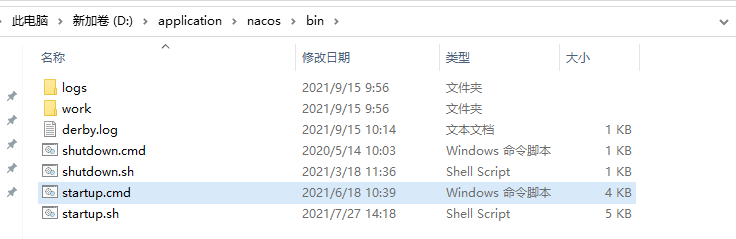
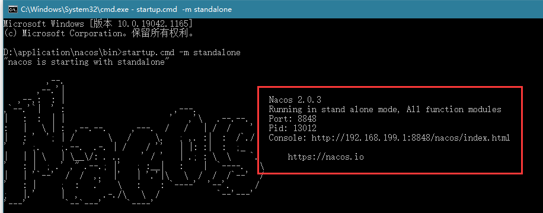
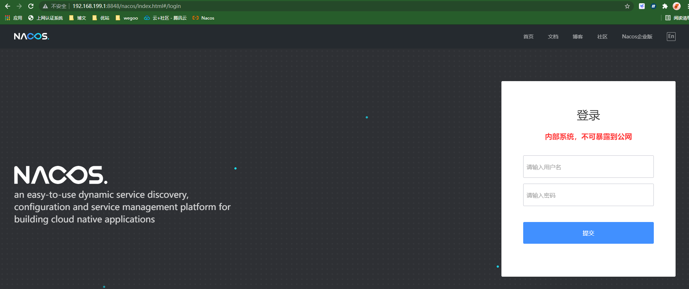
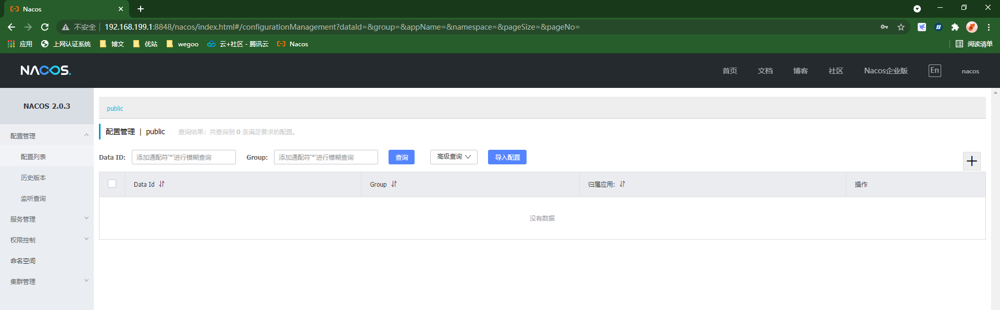
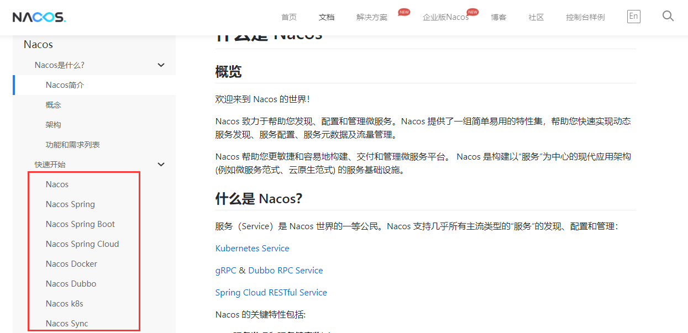
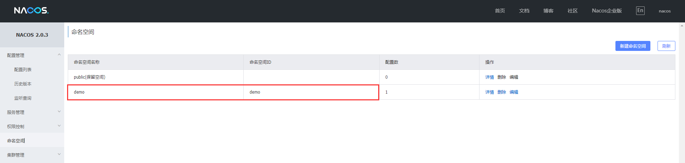
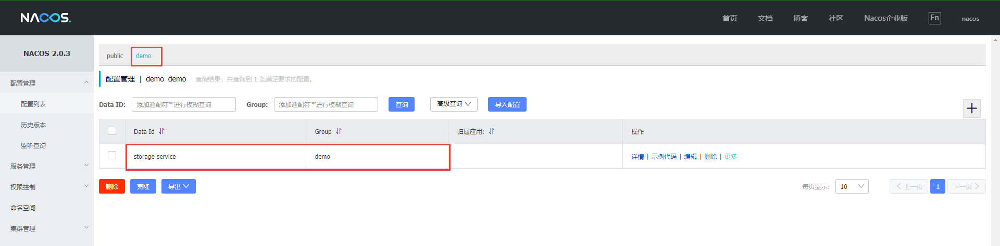
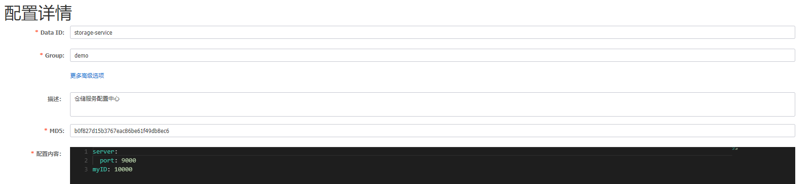
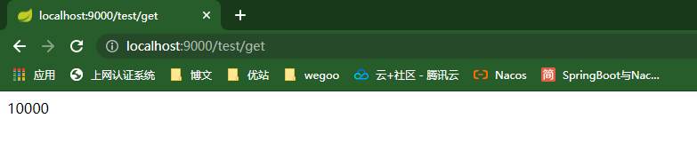
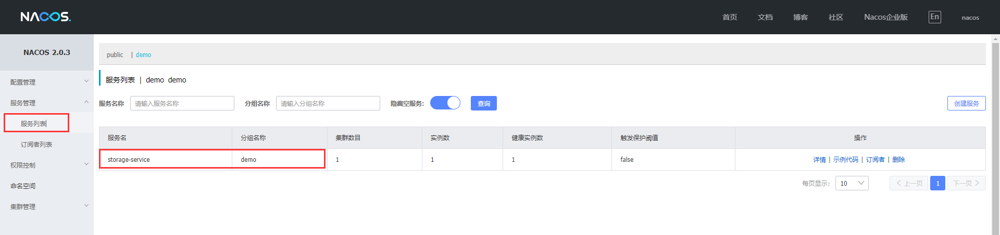

# 概念

Nacos 致力于帮助您发现、配置和管理微服务。Nacos 提供了一组简单易用的特性集，帮助您快速实现动态服务发现、服务配置、服务元数据及流量管理。

# 安装启动

1、下载并解压：

参考官网：https://nacos.io/zh-cn/docs/quick-start.html

2、启动并访问控制台：

这里只演示windows；

在此目录下cmd，并执行startup.cmd -m standalone（standalone代表着单机模式运行，非集群模式）；

注意不要直接双击startup.cmd启动，这样是默认以集群方式启动，没有配置会启动失败；



启动成功图示：



可以发现端口号和控制台地址8848、http://192.168.199.1:8848/nacos/index.html；

访问控制台：（登录用户名和密码都是nacos）



登录成功图示：



# 集成至项目

请参考：https://nacos.io/zh-cn/docs/what-is-nacos.html



==下面的示例是以spring-cloud-alibaba项目为例子，与spring-boot项目在yml的配置文件上会略有不同。==

## 整合nacos配置中心

这里我们以仓储服务为例。

1、在nacos控制台添加命名空间：



2、在demo命名空间下添加配置：

注意：

- 这里的Data Id要与你的应用名称保持一致；（应用名称配置在bootstrap.xml中）

  ```yml
  spring:
    application:
      name: storage-service
  ```

- nacos的配置文件格式选择yaml；





3、配置bootstrap.xml文件：

```yml
spring:
  application:
    name: storage-service
  cloud:
    nacos:
      config:
        server-addr: 127.0.0.1:8848
        namespace: demo
        group: demo
        file-extension: yaml
        refresh-enabled: true
```

4、测试配置中心是否生效：

接口如下：

在nacos中配置的myID以及修改的项目端口9000都应该生效；

```java
@RestController
@RequestMapping("/test")
public class TestController {

    @Value("${myID}")
    private String data;

    @GetMapping("/get")
    public String get() {
        return data;
    }
}
```

访问测试：

可见配置已经生效；



## 整合nacos注册与发现

同样以仓储服务为例。

1、添加依赖：

```xml
<!-- nacos discovery: 服务发现 -->
<dependency>
    <groupId>com.alibaba.cloud</groupId>
    <artifactId>spring-cloud-starter-alibaba-nacos-discovery</artifactId>
</dependency>
```

2、启动类添加注解：

```java
@EnableDiscoveryClient
```

3、配置文件设置：

```yml
spring:
  cloud:
    nacos:
      discovery:
        server-addr: 127.0.0.1:8848
        namespace: demo
        group: demo
```

4、启动项目打开nacos控制台服务列表：




