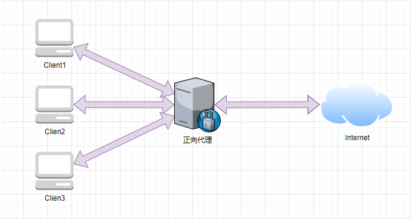
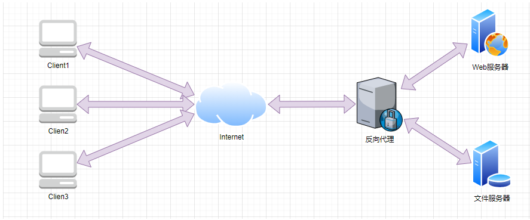

# nginx笔记

## 正向代理

什么是正向代理？

> 1. 正向代理是一个位于客户端和原始服务器之间的代理服务器。为了从原始服务器取得内容，客户端向代理发送一个请求并指定目标(原始服务器)，然后代理向原始服务器转交请求并将获得的内容返回给客户端。
> 2. 代理的对象是客户端。

有什么作用？举个例子。

> 1. 隐藏了真实的客户端。客户端请求的服务都被代理服务器代替来请求。
> 2. 比如VPN，俗称梯子就是应用正向代理的原理。



## 反向代理

什么是反向代理？

> 1. 反向代理是一个位于用户与目标服务器之间的代理服务器。对于用户而言，反向代理服务器就相当于目标服务器，即用户直接访问反向代理服务器就可以获得目标服务器的资源。
> 2. 代理的是目标服务器。

有什么作用？举个例子。

> 1. 隐藏了真实的服务器地址，提高了内部服务器的安全、提高访问速度、负载均衡。
> 2. 比如我们常说的网关，通过代理微服务的接口，隐藏了真实的接口地址，让用户统一访问代理服务器暴露的接口。
> 3. 再如内网穿透，外网的设备是无法直接访问到内网的资源的。这时候我们就可以利用反向代理实现将内网的服务暴露出去。



## 两者区别

> 1. 代理的对象不一样。正向代理的对象是客户端，反向代理的对象是服务端。

## nginx介绍

nginx是什么？

> 1. nginx是一个高性能的HTTP和反向代理web服务器及电子邮件代理服务器。
> 2. 特点是占有内存少，并发能力强。常常应用于Http代理、反向代理、负载均衡、web缓存等。

相关链接

> 1. 下载地址：https://nginx.org/
> 2. 参考文档：https://www.nginx.cn/doc/

安装运行

> 请参考官方文档。

## nginx网关

设置nginx.conf配置文件

```conf
server {
    listen       80;
    server_name  localhost;

    # 微服务 将80端口路由到后端网关服务9000端口
    location /bk-cloud/ {
        proxy_pass http://localhost:9000/;
    }
```

## nginx路由规则

情况一：proxy_pass端口号后为/

```conf
location /bk-cloud/ {
    proxy_pass http://localhost:9000/;
}
```

> 1. 请求路径：http://localhost:9000/bk-cloud/test/
> 2. 代理后路径：http://localhost:9000/test/

情况二：proxy_pass端口号后为空

```conf
location /bk-cloud/ {
    proxy_pass http://localhost:9000;
}
```

> 1. 请求路径：http://localhost:9000/bk-cloud/test/
> 2. 代理后路径：http://localhost:9000/bk-cloud/test/

其它情况：不推荐使用以上两种情况之外的配置，会显得难以看懂。


