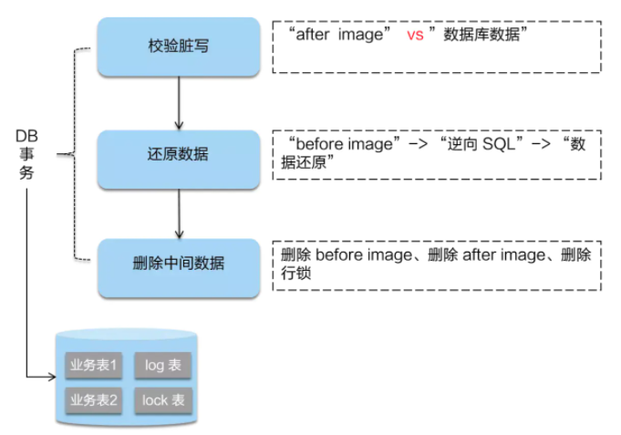
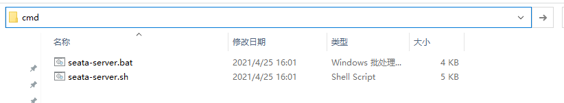
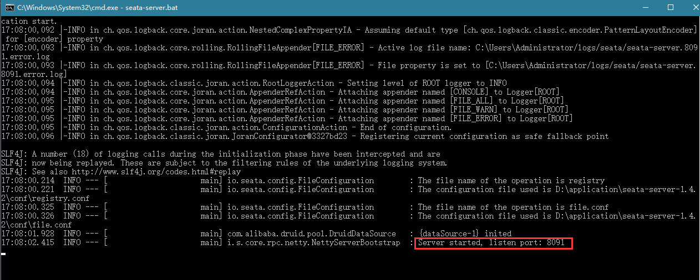
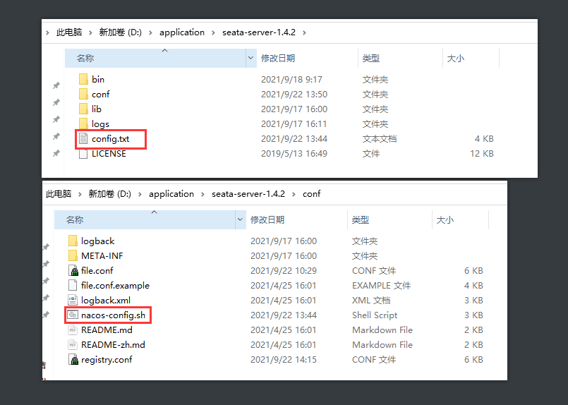

# 分布式事务理论基础

## 2PC

### 概念

两阶段提交协议（Two Phase Commitment Protocol），在此协议中，一个或多个资源管理器的活动均由一个称为事务协调器的单独软件组件来控制。

### 两个阶段

1、准备阶段：

- 应用程序调用事务协调器中的提交方法。
- 事务协调器通知每个资源管理器准备提交事务（这是第一阶段的开始）。
- 资源管理器将包含其计划更改的日记文件写入持久存储区中。如果资源管理器无法准备事务，它会以一个否定响应来回应事务协调器。
- 事务协调器收集来自资源管理器的所有响应。

2、提交阶段：

- 事务协调器将事务的结果通知给所有资源管理器。如果有资源管理器做出否定响应，则事务协调器会将回滚命令发送所有资源管理器。如果资源管理器都做出肯定响应，则事务协调器会指示所有的资源管理器提交事务。一旦通知资源管理器提交，此后的事务就不能失败了。通过以肯定的方式响 应第一阶段，每个资源管理器均已确保，如果以后通知它提交事务，则事务不会失败。

3、过程图示如下：


### 缺点

1、性能问题：

无论是在第一阶段的过程中,还是在第二阶段,所有的资源管理器和事务协调器都是被锁住的,只有当所有节点准备完毕，事务协调器才会通知进行全局提交，资源管理器进行本地事务提交后才会释放资源。这样的过程会比较漫长，对性能影响比较大。

2、单节点故障：

由于事务协调器只有一个，一旦协调器发生故障，资源管理器就会一直阻塞。

（1）协调器正常，资源管理器宕机：

由于协调器无法收到所有资源管理器的响应，会进入阻塞状态；

解决方案：引入超时机制，如果协调器在超过指定的时间还没有收到资源管理器的反馈,事务就失败,向所有节点发送终止事务请求。

（2）协调器宕机，资源管理器正常：

 由于协调器宕机，无法发送提交请求，所有处于执行了操作但是未提交状态的资源管理器都会陷入阻塞情况.

 解决方案：引入协调器备份,同时协调器需记录操作日志.当检测到协调器宕机一段时间后，协调器备份取代协调器，并读取操作日志，向所有资源管理器询问状态。

（2）协调器、资源管理器都宕机：

解决方案：需要重新选举出协调器并重新执行两个阶段；

## 3PC

### 概念

三阶段提交协议（Three Phase Commitment Protocol），把分布式事务的提交过程分为参与者投票表决、预提交、协调者决策三个阶段，主要解决单点故障问题，并减少阻塞，是2PC的改进版本。

与二阶段提交协议不同的是：3PC不仅引入了超时机制，还把2PC的准备阶段再一分为二，形成CanCommit、PreCommit、DoCommit三个阶段。

### 三个阶段

1、CanCommit：

- 协调者写本地日志“BEGIN_COMMIT”，并进入WAIT状态；
- 向所有参与者发送“VOTE_REQUEST”消息；
- 等待并接收参与者发送的对“VOTE_REQUEST”的响应。参与者响应“VOTE_ABORT”或“VOTE_COMMIT”消息给协调者。

2、PreCommit阶段：

协调者将通知事务参与者准备提交或取消事务，写本地的redo和undo日志，但不提交。

- 若收到任何一个参与者发送的“VOTE_ABORT”消息；
  - 写本地“GLOBAL_ABORT”日志，进入ABORT状态；
  - 向所有的参与者发送“GLOBAL_ABORT”消息；
- 若收到所有参与者发送的“VOTE_COMMIT”消息；
  - 写本地“PREPARE_COMMIT”日志，进入PRECOMMIT状态；
  - 向所有的参与者发送“PREPARE _COMMIT”消息；
- 等待并接收参与者发送的对“GLOBAL_ABORT”消息或“PREPARE_COMMIT”消息的确认响应消息。一旦收到所有参与者的“GLOBAL_ABORT”确认消息或者超时没有收到，写本地“END_TRANSACTION”日志流程结束，则不再进入DoCommit阶段。如果收到所有参与者的“PREPARE_COMMIT”确认消息，则进入DoCommit阶段。

3、DoCommit阶段：

- 向所有参与者发送的“GLOBAL _COMMIT”消息；
- 等待并接收参与者发送的对 “GLOBAL_COMMIT”消息的确认响应消息，一旦收到所有参与者的确认消息，写本地“END_TRANSACTION”日志流程结束。

在DoCommit阶段，如果参与者无法及时接收到来自协调者的GLOBAL_COMMIT请求时，会在等待超时之后，会继续进行事务的提交。

### 缺点

相对于2PC，3PC主要解决的单点故障问题，并减少阻塞，因为一旦参与者无法及时收到来自协调者的信息之后，他会默认执行commit。而不会一直持有事务资源并处于阻塞状态。但是这种机制也会导致数据一致性问题，因为，由于网络原因，协调者发送的abort响应没有及时被参与者接收到，那么参与者在等待超时之后执行了commit操作。这样就和其他接到abort命令并执行回滚的参与者之间存在数据不一致的情况。

## 4种mode

4中模式都属于2PC，应为3PC实现起来太难了，所以一般的分布式解决方案都采用2PC。

### AT mode

属于2PC，是一种非侵入式自动补偿事务模式。Seata框架实现了此模式。

在 AT 模式下，用户只需关注自己的“业务 SQL”，用户的 “业务 SQL” 作为一阶段，Seata 框架会自动生成事务的二阶段提交和回滚操作。

1、阶段一：

在一阶段，Seata 会拦截“业务 SQL”，首先解析 SQL 语义，找到“业务 SQL”要更新的业务数据，在业务数据被更新前，将其保存成“before image”，然后执行“业务 SQL”更新业务数据，在业务数据更新之后，再将其保存成“after image”，最后生成行锁。以上操作全部在一个数据库事务内完成，这样保证了一阶段操作的原子性。


2、阶段二：

二阶段如果是提交的话，因为“业务 SQL”在一阶段已经提交至数据库， 所以 Seata 框架只需将一阶段保存的快照数据和行锁删掉，完成数据清理即可。


二阶段如果是回滚的话，Seata 就需要回滚一阶段已经执行的“业务 SQL”，还原业务数据。回滚方式便是用“before image”还原业务数据；但在还原前要首先要校验脏写，对比“数据库当前业务数据”和 “after image”，如果两份数据完全一致就说明没有脏写，可以还原业务数据，如果不一致就说明有脏写，出现脏写就需要转人工处理。



AT 模式的一阶段、二阶段提交和回滚均由 Seata 框架自动生成，用户只需编写“业务 SQL”，便能轻松接入分布式事务，AT 模式是一种对业务无任何侵入的分布式事务解决方案。

### TCC mode

TCC 模式需要用户根据自己的业务场景实现 Try、Confirm 和 Cancel 三个操作；事务发起方在一阶段执行 Try 方式，在二阶段提交执行 Confirm 方法，二阶段回滚执行 Cancel 方法。


TCC 三个方法描述：

- Try：资源的检测和预留；
- Confirm：执行的业务操作提交；要求 Try 成功 Confirm 一定要能成功；
- Cancel：预留资源释放；

### SAGA mode

Saga 理论出自 Hector & Kenneth 1987发表的论文 Sagas。

 Saga模式的实现，是长事务解决方案。Saga 是一种补偿协议，在 Saga 模式下，分布式事务内有多个参与者，每一个参与者都是一个冲正补偿服务，需要用户根据业务场景实现其正向操作和逆向回滚操作。


分布式事务执行过程中，依次执行各参与者的正向操作，如果所有正向操作均执行成功，那么分布式事务提交。如果任何一个正向操作执行失败，那么分布式事务会退回去执行前面各参与者的逆向回滚操作，回滚已提交的参与者，使分布式事务回到初始状态。

Saga 正向服务与补偿服务也需要业务开发者实现。因此是业务入侵的。


Saga 模式下分布式事务通常是由事件驱动的，各个参与者之间是异步执行的，Saga 模式是一种长事务解决方案。

### XA mode

XA是X/Open DTP组织（X/Open DTP group）定义的两阶段提交协议，XA被许多数据库（如Oracle、DB2、SQL Server、MySQL）和中间件等工具(如CICS 和 Tuxedo)本地支持 。X/Open DTP模型（1994）包括应用程序（AP）、事务管理器（TM）、资源管理器（RM）。

XA接口函数由数据库厂商提供。JTA(Java Transaction API) 是Java实现的XA规范的增强版接口。

在XA模式下，需要有一个[全局]协调器，每一个数据库事务完成后，进行第一阶段预提交，并通知协调器，把结果给协调器。协调器等所有分支事务操作完成、都预提交后，进行第二步；第二步：协调器通知每个数据库进行逐个commit/rollback。其中，这个全局协调器就是XA模型中的TM角色，每个分支事务各自的数据库就是RM。

MySQL 提供的XA实现（[https://dev.mysql.com/doc/refman/5.7/en/xa.html](https://links.jianshu.com/go?to=https%3A%2F%2Fdev.mysql.com%2Fdoc%2Frefman%2F5.7%2Fen%2Fxa.html) ）

XA模式下的 开源框架有atomikos，其开发公司也有商业版本。

XA模式缺点：事务粒度大。高并发下，系统可用性低。因此很少使用。

### 4种mode对比分析

四种分布式事务模式，分别在不同的时间被提出，每种模式都有它的适用场景

- AT 模式是无侵入的分布式事务解决方案，适用于不希望对业务进行改造的场景，几乎0学习成本。
- TCC 模式是高性能分布式事务解决方案，适用于核心系统等对性能有很高要求的场景。
- Saga 模式是长事务解决方案，适用于业务流程长且需要保证事务最终一致性的业务系统，Saga 模式一阶段就会提交本地事务，无锁，长流程情况下可以保证性能，多用于渠道层、集成层业务系统。事务参与者可能是其它公司的服务或者是遗留系统的服务，无法进行改造和提供 TCC 要求的接口，也可以使用 Saga 模式。
- XA模式是分布式强一致性的解决方案，但性能低而使用较少。

# Seata

官网文档：https://seata.io/en-us/index.html

demo搭建参考：https://cloud.tencent.com/developer/article/1546858?from=14588

配置参考：https://www.jianshu.com/p/402ac48cf4cc

## 概述

### 是什么

Seata是一个开源分布式事务解决方案，可在微服务体系结构下提供高性能且易于使用分布式事务服务。

### 特点

关于这几个mode的详细参考https://seata.io/en-us/docs/dev/mode/at-mode.html即可；


## 安装与配置

### 1、下载并解压：

从 https://github.com/seata/seata/releases,下载服务器软件包，将其解压缩即可。

解压目录如下：


关注conf文件夹下的两个文件：

- file.conf：用于配置事务信息的存放位置；
- registry.conf：用于配置注册中心与配置中心：


### 2、修改file.conf：

```
## transaction log store, only used in seata-server
store {
  ## store mode: file、db、redis
  mode = "db" # 修改事务信息用db存储，db就是数据库，配置为db后就要配置下面的数据库连接信息
  ## rsa decryption public key
  publicKey = ""
  ## file store property
  file {
    ## store location dir
    dir = "sessionStore"
    # branch session size , if exceeded first try compress lockkey, still exceeded throws exceptions
    maxBranchSessionSize = 16384
    # globe session size , if exceeded throws exceptions
    maxGlobalSessionSize = 512
    # file buffer size , if exceeded allocate new buffer
    fileWriteBufferCacheSize = 16384
    # when recover batch read size
    sessionReloadReadSize = 100
    # async, sync
    flushDiskMode = async
  }

  ## database store property
  db {
    ## the implement of javax.sql.DataSource, such as DruidDataSource(druid)/BasicDataSource(dbcp)/HikariDataSource(hikari) etc.
    datasource = "druid"
    ## mysql/oracle/postgresql/h2/oceanbase etc.
    dbType = "mysql"
    driverClassName = "com.mysql.cj.jdbc.Driver" # mysql8需要加cj，否则会报错
    ## if using mysql to store the data, recommend add rewriteBatchedStatements=true in jdbc connection param
    # 需要加时区，否则可能报错，注意这里的seata-server是稍后要在数据库创建的表
    url = "jdbc:mysql://127.0.0.1:3306/seata-server?rewriteBatchedStatements=true&serverTimezone=GMT%2B8" 
    user = "root" # 用户名
    password = "root" # 密码
    minConn = 5
    maxConn = 100
    globalTable = "global_table" # 这三张表稍后需要在seata-server中创建
    branchTable = "branch_table" # 这三张表稍后需要在seata-server中创建
    lockTable = "lock_table" # 这三张表稍后需要在seata-server中创建
    queryLimit = 100
    maxWait = 5000
  }

  ## redis store property
  redis {
    ## redis mode: single、sentinel
    mode = "single"
    ## single mode property
    single {
      host = "127.0.0.1"
      port = "6379"
    }
    ## sentinel mode property
    sentinel {
      masterName = ""
      ## such as "10.28.235.65:26379,10.28.235.65:26380,10.28.235.65:26381"
      sentinelHosts = ""
    }
    password = ""
    database = "0"
    minConn = 1
    maxConn = 10
    maxTotal = 100
    queryLimit = 100
  }
}
```

### 3、创建seata-server数据库并建表：

全局事务会话信息由3块内容构成，全局事务-->分支事务-->全局锁，对应表global_table、branch_table、lock_table，因此我们创建三张表来保存。此外还有分布式锁表distributed_lock。

建表语句：https://github.com/seata/seata/tree/develop/script/server/db


这是从官网复制的，直接粘贴即可：

```mysql
-- -------------------------------- The script used when storeMode is 'db' --------------------------------
-- the table to store GlobalSession data
CREATE TABLE IF NOT EXISTS `global_table`
(
    `xid`                       VARCHAR(128) NOT NULL,
    `transaction_id`            BIGINT,
    `status`                    TINYINT      NOT NULL,
    `application_id`            VARCHAR(32),
    `transaction_service_group` VARCHAR(32),
    `transaction_name`          VARCHAR(128),
    `timeout`                   INT,
    `begin_time`                BIGINT,
    `application_data`          VARCHAR(2000),
    `gmt_create`                DATETIME,
    `gmt_modified`              DATETIME,
    PRIMARY KEY (`xid`),
    KEY `idx_gmt_modified_status` (`gmt_modified`, `status`),
    KEY `idx_transaction_id` (`transaction_id`)
) ENGINE = InnoDB
  DEFAULT CHARSET = utf8;

-- the table to store BranchSession data
CREATE TABLE IF NOT EXISTS `branch_table`
(
    `branch_id`         BIGINT       NOT NULL,
    `xid`               VARCHAR(128) NOT NULL,
    `transaction_id`    BIGINT,
    `resource_group_id` VARCHAR(32),
    `resource_id`       VARCHAR(256),
    `branch_type`       VARCHAR(8),
    `status`            TINYINT,
    `client_id`         VARCHAR(64),
    `application_data`  VARCHAR(2000),
    `gmt_create`        DATETIME(6),
    `gmt_modified`      DATETIME(6),
    PRIMARY KEY (`branch_id`),
    KEY `idx_xid` (`xid`)
) ENGINE = InnoDB
  DEFAULT CHARSET = utf8;

-- the table to store lock data
CREATE TABLE IF NOT EXISTS `lock_table`
(
    `row_key`        VARCHAR(128) NOT NULL,
    `xid`            VARCHAR(128),
    `transaction_id` BIGINT,
    `branch_id`      BIGINT       NOT NULL,
    `resource_id`    VARCHAR(256),
    `table_name`     VARCHAR(32),
    `pk`             VARCHAR(36),
    `gmt_create`     DATETIME,
    `gmt_modified`   DATETIME,
    PRIMARY KEY (`row_key`),
    KEY `idx_branch_id` (`branch_id`)
) ENGINE = InnoDB
  DEFAULT CHARSET = utf8;

CREATE TABLE IF NOT EXISTS `distributed_lock`
(
    `lock_key`       CHAR(20) NOT NULL,
    `lock_value`     VARCHAR(20) NOT NULL,
    `expire`         BIGINT,
    primary key (`lock_key`)
) ENGINE = InnoDB
  DEFAULT CHARSET = utf8mb4;

INSERT INTO `distributed_lock` (lock_key, lock_value, expire) VALUES ('AsyncCommitting', ' ', 0);
INSERT INTO `distributed_lock` (lock_key, lock_value, expire) VALUES ('RetryCommitting', ' ', 0);
INSERT INTO `distributed_lock` (lock_key, lock_value, expire) VALUES ('RetryRollbacking', ' ', 0);
INSERT INTO `distributed_lock` (lock_key, lock_value, expire) VALUES ('TxTimeoutCheck', ' ', 0);
```

### 4、修改registry.conf文件：

暂时先配置nacos作为注册和配置中心；也可以选择eureka、zk等。

```
registry {
  # file 、nacos 、eureka、redis、zk、consul、etcd3、sofa
  type = "nacos" # 设置nacos作为注册中心，然后配置下面的nacos选项

  nacos {
    application = "seata-server" # 设置seata的服务名，会展示在nacos的服务列表上
    serverAddr = "127.0.0.1:8848" # 配置nacos地址
    group = "SEATA_GROUP" # 设置nacos分组
    namespace = "demo" # 配置命名空间，需要提前在nacos上设置好
    cluster = "default" # 集群配置，不用修改
    username = "nacos" # nacos用户名，默认是nacos
    password = "nacos" # nacos密码，默认是nacos
  }
  eureka {
    serviceUrl = "http://localhost:8761/eureka"
    application = "default"
    weight = "1"
  }
  redis {
    serverAddr = "localhost:6379"
    db = 0
    password = ""
    cluster = "default"
    timeout = 0
  }
  zk {
    cluster = "default"
    serverAddr = "127.0.0.1:2181"
    sessionTimeout = 6000
    connectTimeout = 2000
    username = ""
    password = ""
  }
  consul {
    cluster = "default"
    serverAddr = "127.0.0.1:8500"
    aclToken = ""
  }
  etcd3 {
    cluster = "default"
    serverAddr = "http://localhost:2379"
  }
  sofa {
    serverAddr = "127.0.0.1:9603"
    application = "default"
    region = "DEFAULT_ZONE"
    datacenter = "DefaultDataCenter"
    cluster = "default"
    group = "SEATA_GROUP"
    addressWaitTime = "3000"
  }
  file {
    name = "file.conf"
  }
}

config {
  # file、nacos 、apollo、zk、consul、etcd3
  type = "nacos" # 设置nacos为配置中心

  nacos {
    serverAddr = "127.0.0.1:8848"
    namespace = "seata" # nacos中新建命名空间
    group = "SEATA_GROUP" # 设置分组名，组名不要修改，会影响后面的脚本导入seata配置
    username = "nacos" # 用户名
    password = "nacos" # 密码
  }
  consul {
    serverAddr = "127.0.0.1:8500"
    aclToken = ""
  }
  apollo {
    appId = "seata-server"
    ## apolloConfigService will cover apolloMeta
    apolloMeta = "http://192.168.1.204:8801"
    apolloConfigService = "http://192.168.1.204:8080"
    namespace = "application"
    apolloAccesskeySecret = ""
    cluster = "seata"
  }
  zk {
    serverAddr = "127.0.0.1:2181"
    sessionTimeout = 6000
    connectTimeout = 2000
    username = ""
    password = ""
    nodePath = "/seata/seata.properties"
  }
  etcd3 {
    serverAddr = "http://localhost:2379"
  }
  file {
    name = "file.conf"
  }
}
```

这样就配置好了。

### 5、启动测试：

先启动nacos，然后启动seata；在此处cmd，并执行seata-server.bat；





启动成功后，打开nacos控制台的服务列表，发现seata服务已经注册到nacos中；


### 6、使用脚本导入seata配置到nacos：

1、克隆seata项目获取脚本和配置文件：

- 地址：https://github.com/seata/seata
- 配置文件位置：\seata\script\config-center下的config.txt
- 脚本文件位置：\seata\script\config-center\nacos下的nacos-config.sh 


2、将配置文件和脚本文件分别放到合适位置：

- config.txt：复制到的conf同级目录
- nacos-config.sh ：复制到conf文件夹内



3、修改配置文件：

添加事务组配置，修改数据库连接配置：

```properties
# 添加事务分组配置，可以配置多个分组
service.vgroupMapping.seata-storage-service=default 
# service.vgroupMapping.seata-other-service=other 

# 修改数据库连接配置
store.mode=db
store.db.datasource=druid
store.db.dbType=mysql
store.db.driverClassName=com.mysql.cj.jdbc.Driver
store.db.url=jdbc:mysql://127.0.0.1:3306/seata-server?rewriteBatchedStatements=true&serverTimezone=GMT%2B8
store.db.user=root
store.db.password=root
```

4、nacos添加命名空间seata后，执行脚本命令，导入配置：

添加命名空间：


在conf目录下执行脚本命令：（使用git bash执行）

```bash
# 命令解析：-h -p 指定nacos的端口地址；-g 指定配置的分组，注意，是配置的分组；-t 指定命名空间id； -u -w指定nacos的用户名和密码
$ sh nacos-config.sh -h localhost -p 8848 -g SEATA_GROUP -t seata -u nacos -w nacos
```


5、查看配置：

此时seata的配置全部导入到nacos中了：


## 集成至项目

### 1、为每个业务数据库添加undo_log表：

建表语句从 https://seata.io/zh-cn/docs/user/quickstart.html 获取：这个表就是一阶段提交时会设置的快照，发生回滚时就参考此表进行回滚，回滚后会删除此表的记录。

```mysql
CREATE TABLE `undo_log` (
  `id` bigint(20) NOT NULL AUTO_INCREMENT,
  `branch_id` bigint(20) NOT NULL,
  `xid` varchar(100) NOT NULL,
  `context` varchar(128) NOT NULL,
  `rollback_info` longblob NOT NULL,
  `log_status` int(11) NOT NULL,
  `log_created` datetime NOT NULL,
  `log_modified` datetime NOT NULL,
  `ext` varchar(100) DEFAULT NULL,
  PRIMARY KEY (`id`),
  UNIQUE KEY `ux_undo_log` (`xid`,`branch_id`)
) ENGINE=InnoDB AUTO_INCREMENT=1 DEFAULT CHARSET=utf8;
```

### 2、为每个服务导入seata依赖：

```xml
<!-- alibaba-seata -->
<dependency>
    <groupId>com.alibaba.cloud</groupId>
    <artifactId>spring-cloud-starter-alibaba-seata</artifactId>
    <exclusions>
        <!-- 排除alibaba中集成的seata，然后导入与我们seata服务器相同版本的seata启动器 -->
        <exclusion>
            <groupId>io.seata</groupId>
            <artifactId>seata-spring-boot-starter</artifactId>
        </exclusion>
    </exclusions>
</dependency>
<!-- 导入与我们seata服务器相同版本的seata启动器，而不是seata的单独依赖，因为yml中的seata配置是由starter提供的 -->
<dependency> 
    <groupId>io.seata</groupId>
    <artifactId>seata-spring-boot-starter</artifactId>
    <version>1.4.2</version>
</dependency>
```

### 3、为每个服务添加yml配置：

```yml
seata:
  config:
    type: nacos
    nacos:
      server-addr: 127.0.0.1:8848
      namespace: seata
      group: SEATA_GROUP
      username: nacos
      password: nacos
  registry:
    type: nacos
    nacos:
      namespace: demo
      server-addr: 127.0.0.1:8848
      group: SEATA_GROUP
      username: nacos
      password: nacos
  enable-auto-data-source-proxy: true
  tx-service-group: seata-storage-service # 设置事务分组，需要在nacos中增加一个dataId为service.vgroupMapping.seata-storage-service，内容为default的配置
```


以上就完成了seata的项目集成。

# 事务回滚

## 自动回滚

自动回滚如下：

```java
@Service
public class StorageServiceImpl extends ServiceImpl<StorageMapper, Storage> implements StorageService {

    @Override
    @GlobalTransactional(rollbackFor = Exception.class)
    public void buy(Long productId, Long userId, RestTemplate restTemplate) {
        ...
    }
}
```

## 手动回滚

手动回滚异常如下：

```java
@Service
public class StorageServiceImpl extends ServiceImpl<StorageMapper, Storage> implements StorageService {

    @Override
    @GlobalTransactional(rollbackFor = Exception.class)
    public void buy(Long productId, Long userId, RestTemplate restTemplate) {

        String xid = RootContext.getXID();
        TransactionManager manager = TransactionManagerHolder.get();
        try {
            ...
            int a = 1/0;
            ...
        } catch (Exception e) {
            e.printStackTrace();
            try {
                manager.rollback(xid);
            } catch (TransactionException transactionException) {
                transactionException.printStackTrace();
            }
        } finally {
        }
    }
}
```


